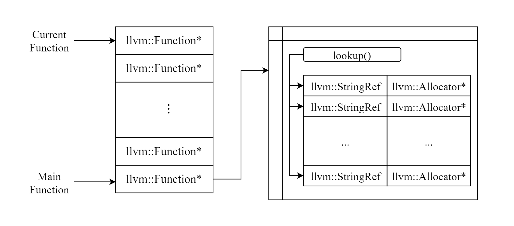
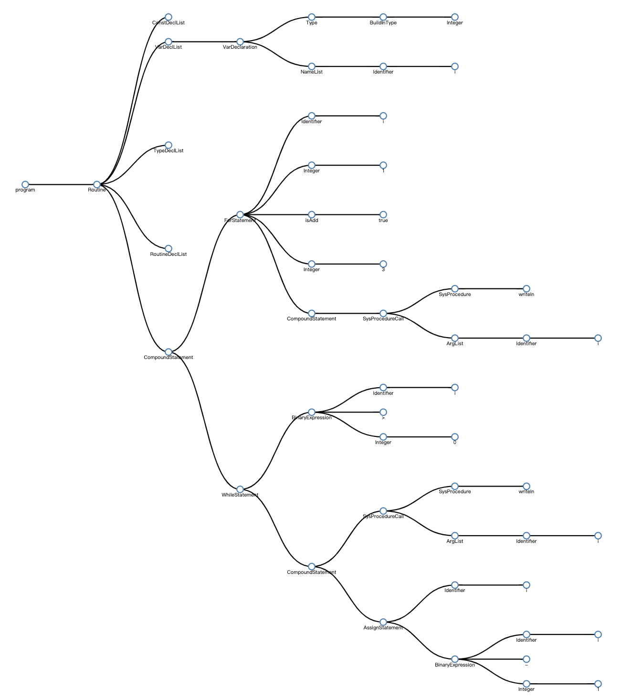

<div style="page-break-after: always;"></div>
[TOC]

<div style="page-break-after: always;"></div>
## 序言

### 3.1 概述

本次实验小组基于C++语言设计并实现了一个SPL语言的编译系统，该系统以符合SPL语言规范的代码文本文输入，输出为指定机器的目标代码。该SPL编译器的设计实现涵盖词法分析、语法分析、语义分析、优化考虑、代码生成等阶段和环节，所使用的具体技术包括但不限于：

- Flex实现词法分析
- Bison实现语法分析
- LLVM实现代码优化、中间代码生成、目标代码生成
- D3.JS实现AST可视化
- LLVM+Graphviz实现CFG可视化


### 3.2 开发环境

- 操作系统：MacOS（推荐使用）或Linux
- 编译环境：
  - Flex 2.5.35 Apple(flex-32)
  - Bison 2.3 (GNU Bison)
  - LLVM 9.0.0
- 编辑器：XCode, Vim

### 3.3 文件说明

本次实验提交的文件及其说明如下：

- src：源代码文件夹

  - spl.l：Flex源代码，主要实现词法分析，生成Token
  - spl.y：Yacc源代码，主要实现语法分析，生成抽象语法树
  - tokenizer.cpp：Flex根据spl.l生成的词法分析器
  - parser.hpp：Yacc根据spl.y生成的语法分析器头文件
  - parser.cpp：Yacc根据spl.y生成的语法分析器C++文件
  - ast.h：抽象语法树头文件，定义所有AST节点类
  - ast.cpp：抽象语法树实现文件，主要包含`codeGen`和`getJoson`方法的实现
  - CodeGenerator.h：中间代码生成器头文件，定义生成器环境
  - CodeGenerator.cpp：中间代码生成器实现文件
  - main.cpp：主函数所在文件，主要负责调用词法分析器、语法分析器、代码生成器
  - util.h：项目的工具函数文件
  - Makefile：定义编译链接规则
  - tree.json：基于AST生成的JSON文件
  - tree.html：可视化AST的网页文件
  - spl：编译器可执行程序

- doc：报告文档文件夹

  - report.pdf：报告文档

  - Slides.pdf：展示文档

- test：测试用例文件夹

  - testX.pas：SPL源程序测试用例

### 3.4 组员分工

| 组员   | 具体分工                      |
| :----- | :---------------------------- |
| 杨建伟 | 词法分析，语法分析，AST可视化 |
| 陈锰   | 语义分析，中间代码生成        |
| 席吉华 | 运行环境设计，目标代码生成    |


## 第壱章 词法分析

词法分析是计算机科学中将字符序列转换为标记（token）序列的过程。在词法分析阶段，编译器读入源程序字符串流，将字符流转换为标记序列，同时将所需要的信息存储，然后将结果交给语法分析器。

### 2.1 Lex

SPL编译器的词法分析使用Lex（Flex）完成，Lex是一个产生词法分析器的程序，是大多数UNIX系统的词法分析器产生程序。

Lex读入lex文件中定义的词法分析规则，输出C语言词法分析器源码。

标准lex文件由三部分组成，分别是定义区、规则区和用户子过程区。在定义区，用户可以编写C语言中的声明语句，导入需要的头文件或声明变量。在规则区，用户需要编写以正则表达式和对应的动作的形式的代码。在用户子过程区，用户可以定义函数。

```c
{definitions}
%%
{rules}
%%
{user subroutines}
```

### 2.2 正则表达式

正则表达式是通过单个字符串描述，匹配一系列符合某个句法规则的字符串。在实际应用中，常用到的语法规则如下（摘录自[维基百科]([https://zh.wikipedia.org/wiki/%E6%AD%A3%E5%88%99%E8%A1%A8%E8%BE%BE%E5%BC%8F](https://zh.wikipedia.org/wiki/正则表达式)))

|   字符   |                             描述                             |
| :------: | :----------------------------------------------------------: |
|   `\`    | 将下一个字符标记为一个特殊字符（File Format Escape，清单见本表）、或一个原义字符（Identity Escape，有^$()*+?.[\{\|共计12个)、或一个向后引用（backreferences）、或一个八进制转义符。例如，“`n`”匹配字符“`n`”。“`\n`”匹配一个换行符。序列“`\\`”匹配“`\`”而“`\(`”则匹配“`(`”。 |
|   `^`    | 匹配输入字符串的开始位置。如果设置了RegExp对象的Multiline属性，^也匹配“`\n`”或“`\r`”之后的位置。 |
|   `$`    | 匹配输入字符串的结束位置。如果设置了RegExp对象的Multiline属性，$也匹配“`\n`”或“`\r`”之前的位置。 |
|   `*`    | 匹配前面的子表达式零次或多次。例如，zo*能匹配“`z`”、“`zo`”以及“`zoo`”。*等价于{0,}。 |
|   `+`    | 匹配前面的子表达式一次或多次。例如，“`zo+`”能匹配“`zo`”以及“`zoo`”，但不能匹配“`z`”。+等价于{1,}。 |
|   `?`    | 匹配前面的子表达式零次或一次。例如，“`do(es)?`”可以匹配“`does`”中的“`do`”和“`does`”。?等价于{0,1}。 |
|  `{n}`   | *n*是一个非负整数。匹配确定的*n*次。例如，“`o{2}`”不能匹配“`Bob`”中的“`o`”，但是能匹配“`food`”中的两个o。 |
|  `{n,}`  | *n*是一个非负整数。至少匹配*n*次。例如，“`o{2,}`”不能匹配“`Bob`”中的“`o`”，但能匹配“`foooood`”中的所有o。“`o{1,}`”等价于“`o+`”。“`o{0,}`”则等价于“`o*`”。 |
| `{n,m}`  | *m*和*n*均为非负整数，其中*n*<=*m*。最少匹配*n*次且最多匹配*m*次。例如，“`o{1,3}`”将匹配“`fooooood`”中的前三个o。“`o{0,1}`”等价于“`o?`”。请注意在逗号和两个数之间不能有空格。 |
|   `?`    | 非贪心量化（Non-greedy quantifiers）：当该字符紧跟在任何一个其他重复修饰符（*,+,?，{*n*}，{*n*,}，{*n*,*m*}）后面时，匹配模式是**非**贪婪的。非贪婪模式尽可能少的匹配所搜索的字符串，而默认的贪婪模式则尽可能多的匹配所搜索的字符串。例如，对于字符串“`oooo`”，“`o+?`”将匹配单个“`o`”，而“`o+`”将匹配所有“`o`”。 |
|   `.`    | 匹配除“`\r`”“`\n`”之外的任何单个字符。要匹配包括“`\r`”“`\n`”在内的任何字符，请使用像“`(.|\r|\n)`”的模式。 |
|  `x|y`   | 没有包围在()里，其范围是整个正则表达式。例如，“`z|food`”能匹配“`z`”或“`food`”。“`(?:z|f)ood`”则匹配“`zood`”或“`food`”。 |
| `[xyz]`  | 字符集合（character class）。匹配所包含的任意一个字符。例如，“`[abc]`”可以匹配“`plain`”中的“`a`”。特殊字符仅有反斜线\保持特殊含义，用于转义字符。其它特殊字符如星号、加号、各种括号等均作为普通字符。脱字符^如果出现在首位则表示负值字符集合；如果出现在字符串中间就仅作为普通字符。连字符 - 如果出现在字符串中间表示字符范围描述；如果如果出现在首位（或末尾）则仅作为普通字符。右方括号应转义出现，也可以作为首位字符出现。 |
| `[^xyz]` | 排除型字符集合（negated character classes）。匹配未列出的任意字符。例如，“`[^abc]`”可以匹配“`plain`”中的“`plin`”。 |
| `[a-z]`  | 字符范围。匹配指定范围内的任意字符。例如，“`[a-z]`”可以匹配“`a`”到“`z`”范围内的任意小写字母字符。 |
| `[^a-z]` | 排除型的字符范围。匹配任何不在指定范围内的任意字符。例如，“`[^a-z]`”可以匹配任何不在“`a`”到“`z`”范围内的任意字符。 |
|   `\d`   | 匹配一个数字字符。等价于[0-9]。注意Unicode正则表达式会匹配全角数字字符。 |
|   `\D`   |              匹配一个非数字字符。等价于[^0-9]。              |
|   `\n`   |              匹配一个换行符。等价于\x0a和\cJ。               |
|   `\r`   |              匹配一个回车符。等价于\x0d和\cM。               |
|   `\s`   | 匹配任何空白字符，包括空格、制表符、换页符等等。等价于[ \f\n\r\t\v]。注意Unicode正则表达式会匹配全角空格符。 |
|   `\S`   |          匹配任何非空白字符。等价于[^ \f\n\r\t\v]。          |
|   `\w`   | 匹配包括下划线的任何单词字符。等价于“`[A-Za-z0-9_]`”。注意Unicode正则表达式会匹配中文字符。 |
|   `\W`   |        匹配任何非单词字符。等价于“`[^A-Za-z0-9_]`”。         |

### 2.3 具体实现

#### 2.3.1 定义区

SPL的Lex源程序在定义区导入了需要的头文件，包括ast.h（抽象语法树头文件）、parser.hpp（yacc生成的词法分析器头文件）、stdio.h（C语言标准输入输出头文件）、string（C++ std::string头文件），然后声明了lex需要的yywrap函数。

```c
%{
#include "ast.h"
#include "parser.hpp"
#include <stdio.h>
#include <string>
extern "C" int yywrap() { }
%}
```

#### 2.3.2 规则区

首先，需要排除空格、换行和回车的干扰，方法是把他们解析为;

```c
[ \t\n]                                                 { ; }
```

然后解析关键字、运算符和界符，由于运算符与界符是固定的，所以正则表达式只需要也是固定字符。

```c
"("                                                     { return LP; }
")"                                                     { return RP; }
"["                                                     { return LB; }
"]"                                                     { return RB; }
".."                                                    { return DOTDOT; }
"."                                                     { return DOT; }
","                                                     { return COMMA; }
":"                                                     { return COLON; }
"*"                                                     { return MUL; }
"/"                                                     { return DIV; }
"<>"                                                    { return UNEQUAL; }
"not"                                                   { return NOT; }
"+"                                                     { return PLUS; }
"-"                                                     { return MINUS; }
">="                                                    { return GE; }
">"                                                     { return GT; }
"<="                                                    { return LE; }
"<"                                                     { return LT; }
"="                                                     { return EQUAL; }
":="                                                    { return ASSIGN; }
"mod"                                                   { return MOD; }
";"                                                     { return SEMI; }
"and"                                                   { return AND; }
"array"                                                 { return ARRAY; }
"begin"                                                 { return TOKEN_BEGIN; }
"case"                                                  { return CASE; }
"const"                                                 { return CONST; }
"div"                                                   { return DIV; }
"do"                                                    { return DO; }
"downto"                                                { return DOWNTO; }
"else"                                                  { return ELSE; }
"end"                                                   { return END; }
"for"                                                   { return FOR; }
"function"                                              { return FUNCTION; }
"goto"                                                  { return GOTO; }
"if"                                                    { return IF; }
"of"                                                    { return OF; }
"or"                                                    { return OR; }
"procedure"                                             { return PROCEDURE; }
"program"                                               { return PROGRAM; }
"record"                                                { return RECORD; }
"repeat"                                                { return REPEAT; }
"then"                                                  { return THEN; }
"to"                                                    { return TO; }
"type"                                                  { return TYPE; }
"until"                                                 { return UNTIL; }
"var"                                                   { return VAR; }
"while"                                                 { return WHILE; }
```

标识符是由字母或下划线开头，由字母、数字和下划线组成的字符串，并且不能是关键字、SYS_CON、SYS_FUNCT 、SYS_PROC、SYS_TYPE之外的ID。SPL编译器在词法分析阶段只校验是否符合标识符规则，而不校验是否存在。不同于运算符，标识符需要额外保存字符串值。

```c
[a-zA-Z_][a-zA-Z0-9_]*                                  { 
                                                            yylval.sVal = new std::string(yytext, yyleng);
                                                            return IDENTIFIER; 
                                                        } 
```

然后其他需要额外保存值的单词：

```c
"boolean"|"char"|"integer"|"real"                       {
                                                            yylval.sVal = new std::string(yytext, yyleng); 
                                                            return SYS_TYPE; 
                                                        }
"abs"|"chr"|"odd"|"ord"|"pred"|"sqr"|"sqrt"|"succ"      {
                                                            yylval.sVal = new std::string(yytext, yyleng); 
                                                            return SYS_FUNCT; 
                                                        }
"false"|"maxint"|"true"                                 {
                                                            yylval.sVal = new std::string(yytext, yyleng); 
                                                            return SYS_CON; 
                                                        }
"write"|"writeln"                                       { 
                                                            yylval.sVal = new std::string(yytext, yyleng);
                                                            return SYS_PROC; 
                                                        }
"read"                                                  { 
                                                            yylval.sVal = new 																																					std::string(yytext, yyleng);
                                                            return READ; 
                                                        }
[0-9]+\.[0-9]+                                          { 
                                                            double dtmp;
                                                            sscanf(yytext, "%lf", &dtmp);
                                                            yylval.dVal = dtmp;
                                                            return REAL; 
                                                        }
[0-9]+                                                  {
                                                            int itmp;                                                           																														double tmp;
                                                            sscanf(yytext, "%d", &itmp);
                                                            yylval.iVal = itmp; 
                                                            return INTEGER; 
                                                        }
\'.\'                                                   { 
                                                            yylval.cVal = yytext[1];
                                                            return CHAR; 
                                                        }
```

在系统函数、类型等系统单词（以SYS开头）中，词法分析器需要记录字符串串值以使得语法分析器能区分是哪个函数或类型。

对于整型、浮点型，在词法分析阶段使用C语言转换为对应类型存储。

字符型使用以'开头结尾，中间为任意字符的正则表达式识别，将中间字符存储。

## 第弐章 语法分析

在计算机科学和语言学中，语法分析是根据某种给定的形式文法对由单词序列（如英语单词序列）构成的输入文本进行分析并确定其语法结构的一种过程。在词法分析阶段，编译器接收词法分析器发送的标记序列，最终输出抽象语法树数据结构。

### 3.1 Yacc

SPL编译器的语法分析使用Yacc（Bison）完成。Yacc是Unix/Linux上一个用来生成编译器的编译器（编译器代码生成器）。Yacc生成的编译器主要是用C语言写成的语法解析器（Parser），需要与词法解析器Lex一起使用，再把两部分产生出来的C程序一并编译。

与Lex相似，Yacc的输入文件由以%%分割的三部分组成，分别是声明区、规则区和程序区。三部分的功能与Lex相似，不同的是规则区的正则表达式替换为CFG，在声明区要提前声明好使用到的终结符以及非终结符的类型。

```c
  declarations
  %%
  rules
  %%
  programs
```

### 3.2 抽象语法树

语法分析器的输出是抽象语法树。在计算机科学中，抽象语法树是源代码语法结构的一种抽象表示。它以树状的形式表现编程语言的语法结构，树上的每个节点都表示源代码中的一种结构。之所以说语法是“抽象”的，是因为这里的语法并不会表示出真实语法中出现的每个细节。比如，嵌套括号被隐含在树的结构中，并没有以节点的形式呈现；而类似于 if-condition-then 这样的条件跳转语句，可以使用带有三个分支的节点来表示。

SPL编译器的抽象语法树利用面向对象的设计思想进行抽象，下面是语法树的继承体系：


#### 3.2.1 Node类

Node类是一个抽象类，其意义为"抽象语法树的节点"，这是抽象语法树所有节点（在下文简称AST）的共同祖先。该类拥有两个纯虚函数，分别是codeGen和getJson，分别用于生成中间代码和生成AST可视化需要的Json数据。

```cpp
class Node
{
public:
    virtual llvm::Value *codeGen(CodeGenerator & generator) = 0;
    virtual string getJson(){return "";};
};
```

#### 3.2.2 Expression类和Statement类

Expression和Statement是大部分实体类的父类。Expression的语义是表达式类，它的子类的特征是可获得值或可更改值，也就是左值或者右值，比如二元表达式或变量。Statement类的语义是语句类，它的子类的特征是该类会进行操作，比如赋值、比较、条件控制等。

另外，Statement类具有一个label属性，其意义是Goto语句的跳转标志。

```cpp
// 表达式，特征是能返回值或能存储值
class Expression : public Node
{
};

// 语句，特征是能完成某些操作
class Statement : public Node
{
public:
    // 用于Goto语句设置标号
    void setLabel(int label)
    // 用于得到Goto语句需要的标号，若不存在则返回-1
    int getLable()
private:
    int label = -1;
};
```

#### 3.2.3 Program类

Program类的意义是程序，该类是最顶层的实体类，包括程序名和Routine类对象

```cpp
class Program : public Node {
public:
    Program(string *programID, Routine *routine) : programID(programID), routine(routine) { }
    virtual llvm::Value *codeGen(CodeGenerator & generator) override;
    virtual string getJson() override;
private:
    string *programID;
    Routine *routine;
};
```

#### 3.2.4 Routine类

Routine类的意义是一个过程，该类用在Program和Function类中。Routine类包括常量声明、类型声明、变量声明、函数声明和语句部分。

```cpp
class Routine : public Node {
public:
    Routine(ConstDeclList *cd, TypeDeclList *tp, VarDeclList *vd, RoutineList *rl) 
    void setRoutineBody(CompoundStatement *routineBody) { this->routineBody = routineBody; }
    virtual llvm::Value *codeGen(CodeGenerator & generator) override;
    virtual string getJson() override;
    void setGlobal()
private:
    ConstDeclList *constDeclList;
    VarDeclList *varDeclList;
    TypeDeclList *typeDeclList;
    RoutineList *routineList;
    CompoundStatement *routineBody;
};
```

#### 3.2.5 Identifier类

Identifier的意义是标识符，包括一个name字段。该类是实体类，实现了代码生成和Json获取函数。

```cpp
class Identifier : public Expression
{
public:
    Identifier(string *name) : name(name)
    string getName()
    virtual string getJson() override;
    virtual llvm::Value *codeGen(CodeGenerator & generator) override;
private:
    string *name;
};
```

#### 3.2.6 ConstValue类

该类的意义是常量节点，由于常量的类型很多，所以ConstValue是一个抽象类，具体由Integer、Real、Boolean、Char四个子类完成，通过Union和getType函数获得真实的值。

```cpp
class ConstValue : public Expression
{
public:
    union Value {
        int i;
        double r;
        bool b;
        char c;
    };
    virtual BuildInType getType() = 0;
    virtual ConstValue::Value getValue() = 0;
    virtual ConstValue *operator-() = 0;
    virtual bool isValidConstRangeType()
    {
        BuildInType t = getType();
        return t == SPL_INTEGER || t == SPL_CHAR;
    }
};
```

#### 3.2.7 AstType类

该类的意义是SPL支持的类型，包括数组、记录、枚举、常量范围、枚举范围、内置类型和用户自定义类型。实现方法是该类集成以上各个类对象，通过TypeOfType枚举确定AstType的真实类型。

```cpp
// 类型
class AstType : public Statement {
public:
    enum TypeOfType {
        SPL_ARRAY,
        SPL_RECORD,
        SPL_ENUM,
        SPL_CONST_RANGE,
        SPL_ENUM_RANGE,
        SPL_BUILD_IN,
        SPL_USER_DEFINE,
        SPL_VOID
    };
    AstArrayType *arrayType;
    RecordType *recordType;
    EnumType *enumType;
    ConstRangeType *constRangeType;
    EnumRangeType *enumRangeType;
    BuildInType buildInType;
    Identifier *userDefineType;
    TypeOfType type;
};
```

#### 3.2.8 BinaryExpression类

该类的意义是二元表达式，节点存储有左表达式、右表达式和操作符

```cpp
class BinaryExpression : public Expression {
public:
    enum BinaryOperator {
        SPL_PLUS,
        SPL_MINUS,
        SPL_MUL,
        SPL_DIV,
        SPL_GE,
        SPL_GT, 
        SPL_LT,
        SPL_LE,
        SPL_EQUAL,
        SPL_UNEQUAL,
        SPL_OR,
        SPL_MOD,
        SPL_AND,
        SPL_XOR,
    };
    BinaryExpression(Expression *lhs, BinaryOperator op, Expression *rhs) : lhs(lhs), op(op), rhs(rhs) {     }
private:
    vector<string> opString{"+", "-", "*", "/", ">=", ">", "<", "<=", "==", "!=", "or", "mod", "and", "xor"};
    Expression *lhs;
    Expression *rhs;
    BinaryOperator op;
};
```

#### 3.2.9 常量声明

常量声明的顶层类是ConstDeclaration，由变量名(Identifier)、常量值(ConstValue)，变量类型(AstType)三部分构成。

```cpp
// 常量声明语句
class ConstDeclaration : public Statement
{
public:
    ConstDeclaration(Identifier *ip, ConstValue *cp) : name(ip), value(cp), globalFlag(false)
    {
    }
    virtual llvm::Value *codeGen(CodeGenerator & generator) override;
    virtual string getJson() override;
    void setGlobal()
    bool isGlobal()
private:
    Identifier *name;
    ConstValue *value;
    AstType *type;
    bool globalFlag;
};
```

#### 3.2.10 变量声明

变量声明的顶层类是VarDeclaration，由变量名列表(Vector\<Identifier\>)、变量类型(AstType)构成。

```cpp
class VarDeclaration : public Statement {
public:
    VarDeclaration(NameList *nl, AstType *td) : nameList(nl), type(td), globalFlag(false) {}
    virtual llvm::Value *codeGen(CodeGenerator & generator) override;
    virtual string getJson() override;
    void setGlobal()
    bool isGlobal()
private:
    NameList *nameList;
    AstType *type;
    bool globalFlag;
};
```

#### 3.2.11 类型声明

类型声明的顶层类是TypeDeclaration，由类型名(Identifier)、变量类型(AstType)三部分构成。

```cpp
class TypeDeclaration : public Statement {
public:
    virtual llvm::Value *codeGen(CodeGenerator & generator) override;
    TypeDeclaration(Identifier *name, AstType *type) : name(name), type(type)
    virtual string getJson() override;
private:
    Identifier *name;
    AstType *type;
};
```

#### 3.2.12 过程声明

过程声明的顶层类是FuncDeclaration，由类型名(Identifier)、参数类型列表(vector\<Parameter\>)、返回值类型(AstType)、子过程(Routine)构成。过程声明在SPL的语义中会区分是函数（Function）还是过程（Procedure）。在AST中，通过返回值类型指针是否为空来区分过程与函数。

```cpp
class FuncDeclaration : public Statement {
public: 
    FuncDeclaration(Identifier *name, ParaList *paraList, AstType *returnType);
    FuncDeclaration(Identifier *name, ParaList *paraList);
    virtual llvm::Value *codeGen(CodeGenerator & generator) override;
    void setRoutine(Routine *routine)
    virtual string getJson() override;
private:
    Identifier *name;
    ParaList *paraList;
    AstType *returnType;
    Routine *subRoutine;
};
```

#### 3.2.13 复合语句

复合语句的意义是语句列表，由一系列语句组成。该类由StatementList组成。

```cpp
class CompoundStatement : public Statement {
public:
    CompoundStatement(StatementList *stmtList) : stmtList(stmtList) { }
    virtual llvm::Value *codeGen(CodeGenerator & generator) override;

    virtual string getJson() override;
private:
    StatementList *stmtList;
};
```

#### 3.2.14 其他

上面介绍顶层类和重要的底层类，其他的类大同小异，都是将语法树中需要的东西保存起来。能求值的继承自Expression类，例如BinaryExpression、ArrayReferenc等；能独立成句的继承自Statement类，如IfStatement、WhileStatement等；又能求值又独立成句的同时继承自Expression类和Statement类，如FunctionCall等。

### 3.3 语法分析的具体实现

首先在声明区声明好终结符和非终结符类型

```c
%token  LP RP LB RB DOT COMMA COLON
        MUL UNEQUAL NOT PLUS MINUS
        GE GT LE LT EQUAL ASSIGN MOD DOTDOT
        SEMI
        AND ARRAY TOKEN_BEGIN CASE CONST
        DIV DO DOWNTO ELSE END
        FOR FUNCTION GOTO
        IF OF OR
        PROCEDURE PROGRAM RECORD REPEAT
        THEN TO TYPE UNTIL VAR WHILE
%token<iVal> INTEGER
%token<sVal> IDENTIFIER SYS_CON SYS_FUNCT SYS_PROC SYS_TYPE READ
%token<dVal> REAL
%token<cVal> CHAR

%type<identifier>                       name
%type<program>                          program
%type<sVal>                             program_head
%type<routine>                          routine routine_head sub_routine
%type<constDeclList>                    const_part const_expr_list
%type<typeDeclList>                     type_part type_decl_list
%type<typeDeclaration>                  type_definition
%type<varDeclList>                      var_part var_decl_list
%type<varDeclaration>                   var_decl
%type<routineList>                      routine_part
%type<constValue>                       const_value
%type<type>                             type_decl simple_type_decl array_type_decl record_type_decl
%type<nameList>                         name_list
%type<fieldList>                        field_decl_list
%type<fieldDeclaration>                 field_decl
%type<funcDeclaration>                  function_decl procedure_decl function_head procedure_head
%type<paraList>                         parameters para_decl_list
%type<parameter>                        para_type_list var_para_list val_para_list
%type<statement>                        stmt non_label_stmt else_clause
%type<assignStatement>                  assign_stmt
%type<statement>                        proc_stmt     
%type<expressionList>                   expression_list
%type<expression>                       expression expr term factor
%type<argsList>                         args_list 
%type<ifStatement>                      if_stmt 
%type<repeatStatement>                  repeat_stmt
%type<whileStatement>                   while_stmt
%type<forStatement>                     for_stmt
%type<bVal>                             direction
%type<caseStatement>                    case_stmt
%type<caseExprList>                     case_expr_list
%type<caseExpression>                   case_expr
%type<gotoStatement>                    goto_stmt
%type<statementList>                    stmt_list
%type<compoundStatement>                routine_body compound_stmt 
```

接着按从下往上的顺序构造语法树，部分文法如下：

```c
%start program
%%
// 
name: IDENTIFIER                                            { $$ = new Identifier($1); }
                                                            ;
                                                            
program: program_head routine DOT                           { $$ = new Program($1, $2); root = $$; }
                                                            ;
                                                            
program_head: PROGRAM IDENTIFIER SEMI                       { $$ = $2; }
                                                            ;
                                                            
routine: routine_head routine_body                          { $$ = $1; $$->setRoutineBody($2); }
                                                            ;
                                                            
routine_head: const_part  type_part  var_part  routine_part { $$ = new Routine($1, $2, $3, $4); }
                                                            ;
                                                            
const_part :                                                
    CONST  const_expr_list                                  { $$ = $2; }
    |                                                       { $$ = new ConstDeclList(); }
                                                            ;
const_expr_list :                                           
    const_expr_list  name  EQUAL  const_value  SEMI         { $$ = $1; $$->push_back(new ConstDeclaration($2, $4)); }
    |  name  EQUAL  const_value  SEMI                       { $$ = new ConstDeclList(); $$->push_back(new ConstDeclaration($1, $3)); }
                                                            ;
const_value :                                               
    INTEGER                                                 { $$ = new Integer($1); }
    |  REAL                                                 { $$ = new Real($1); }
    |  CHAR                                                 { $$ = new Char($1); }
    |  SYS_CON                                              {
                                                                if(*$1 == "true")
                                                                    $$ = new Boolean(true);
                                                                else if(*$1 == "false")
                                                                    $$ = new Boolean(false);
                                                                else
                                                                    $$ = new Integer(0x7FFFFFFF);
                                                            }
                                                            ;
                                                            
type_part :                                                 
    TYPE type_decl_list                                     { $$ = $2; }
    |                                                       { $$ = new TypeDeclList(); }
                                                            ;
                                                            
type_decl_list :                                            
    type_decl_list  type_definition                         { $$ = $1; $$->push_back($2); }
    |  type_definition                                      { $$ = new TypeDeclList(); $$->push_back($1); }
                                                            ;
                                                            
type_definition :                                           
    name  EQUAL  type_decl  SEMI                            { $$ = new TypeDeclaration($1, $3); }
                                                            ;
                                                            
type_decl :                                                 
    simple_type_decl                                        { $$ = $1; }
    |  array_type_decl                                      { $$ = $1; }
    |  record_type_decl                                     { $$ = $1; }
                                                            ;
simple_type_decl :                                          
    SYS_TYPE                                                {
                                                                if(*$1 == "integer")
                                                                    $$ = new AstType(SPL_INTEGER);
                                                                else if(*$1 == "boolean")
                                                                    $$ = new AstType(SPL_BOOLEAN);
                                                                else if(*$1 == "real")
                                                                    $$ = new AstType(SPL_REAL);
                                                                else if(*$1 == "char")
                                                                    $$ = new AstType(SPL_CHAR);
                                                                else
                                                                    cout << "UNKNOWN SYS_TYPE" << endl;
                                                            }
    |  name                                                 { $$ = new AstType($1); }
    |  LP  name_list  RP                                    { $$ = new AstType(new EnumType($2)); }
    |  const_value  DOTDOT  const_value                     { $$ = new AstType(new ConstRangeType($1, $3)); }
    |  MINUS  const_value  DOTDOT  const_value              { $$ = new AstType(new ConstRangeType(-*$2, $4)); }
    |  MINUS  const_value  DOTDOT  MINUS  const_value       { $$ = new AstType(new ConstRangeType(-*$2, -*$5)); }
    |  name  DOTDOT  name                                   { $$ = new AstType(new EnumRangeType($1, $3)); }
                                                            ;
```

### 3.4 抽象语法树可视化 

语法树可视化使用d3.js完成，d3.js可以通过Json数据绘制出树图html，AST可以通过根节点(Program)的getJson方法获得Json数据。

语法树可视化工作流如下：

1. 生成AST
2. 调用getJson方法
3. 在tree.html下构建一个服务器，推荐使用VSCode的liveServer，也可以自己搭建一个apache服务器，注意要把tree.html和tree.json放在同一路径下
4. 打开浏览器，输入服务器地址，即可看到树图。

JSON数据获取函数：

```C++
string getJsonString(string name) {
    return "{ \"name\" : \"" + name + "\" }";
}

string getJsonString(string name, vector<string> children) {
    string result = "{ \"name\" : \"" + name + "\", \"children\" : [ ";
    int i = 0;
    for(auto &child : children) {
        if(i != children.size() - 1)
            result += child + ", ";
        else 
            result += child + " ";
        i++;
    }
    return result + " ] }";
}

string getJsonString(string name, string value) {
    return getJsonString(name, vector<string>{value});
}

string getJsonString(string name, string value, vector<string> children) {
    string result = "{ \"name\" : \"" + name + "\", \"value\" : \"" + value + "\", \"children\" : [ ";
    int i = 0;
    for(auto &child : children) {
        if(i != children.size() - 1)
            result += child + ", ";
        else 
            result += child + " ";
        i++;
    }
    return result + " ] }";
}
```

具体效果如下：


## 第参章 语义分析

### 3.1 LLVM概述

LLVM(Low Level Virtual Machine)是以C++编写的编译器基础设施，包含一系列模块化的编译器组件和工具教练用俩开发编译器前端和后端。LLVM起源于2000年伊利诺伊大学Vikram Adve和Chris Lattner的研究，它是为了任意一种编程语言而写成的程序，利用虚拟技术创造出编译阶段、链接阶段、运行阶段以及闲置阶段的优化，目前支持Ada、D语言、Fortran、GLSL、Java字节码、Swift、Python、Ruby等十多种语言。

- 前端：LLVM最初被用来取代现有于GCC堆栈的代码产生器，许多GCC的前端已经可以与其运行，其中Clang是一个新的编译器，同时支持C、Objective-C以及C++。
- 中间端：LLVM IR是一种类似汇编的底层语言，一种强类型的精简指令集，并对目标指令集进行了抽象。LLVM支持C++中对象形式、序列化bitcode形式和汇编形式。
- 后端：LLVM支持ARM、Qualcomm Hexagon、MPIS、Nvidia并行指令集等多种后端指令集。

### 3.2 LLVM IR

LLVM IR是LLVM的核心所在，通过将不同高级语言的前端变换成LLVM IR进行优化、链接后再传给不同目标的后端转换成为二进制代码，前端、优化、后端三个阶段互相解耦，这种模块化的设计使得LLVM优化不依赖于任何源码和目标机器。


#### 3.2.1 IR布局

每个IR文件称为一个Module，它是其他所有IR对象的顶级容器，包含了目标信息、全局符号和所依赖的其他模块和符号表等对象的列表，其中全局符号又包括了全局变量、函数声明和函数定义。

函数由参数和多个基本块组成，其中第一个基本块称为entry基本块，这是函数开始执行的起点，另外LLVM的函数拥有独立的符号表，可以对标识符进行查询和搜索。

每一个基本块包含了标签和各种指令的集合，标签作为指令的索引用于实现指令间的跳转，指令包含Phi指令、一般指令以及终止指令等。


#### 3.2.2 IR上下文环境

- LLVM::Context：提供用户创建变量等对象的上下文环境，尤其在多线程环境下至关重要
- LLVM::IRBuilder：提供创建LLVM指令并将其插入基础块的API

#### 3.2.3 IR核心类


- llvm::Value表示一个类型的值，具有一个llvm::Type*成员和一个use list，前者指向值的类型类，后者跟踪使用了该值的其他对象，可以通过迭代器进行访问。

  - 值的存取分别可以通过llvm::LoadInst和llvm::StoreInst实现，也可以借助IRBuilder的CreateLoad和CreateStore实现。
- llvm::Type表示类型类，LLVM支持17种数据类型，可以通过Type ID判断类型：

```C++
 enum TypeID {
    // PrimitiveTypes - make sure LastPrimitiveTyID stays up to date.
    VoidTyID = 0,    ///<  0: type with no size
    HalfTyID,        ///<  1: 16-bit floating point type
    FloatTyID,       ///<  2: 32-bit floating point type
    DoubleTyID,      ///<  3: 64-bit floating point type
    X86_FP80TyID,    ///<  4: 80-bit floating point type (X87)
    FP128TyID,       ///<  5: 128-bit floating point type (112-bit mantissa)
    PPC_FP128TyID,   ///<  6: 128-bit floating point type (two 64-bits, PowerPC)
    LabelTyID,       ///<  7: Labels
    MetadataTyID,    ///<  8: Metadata
    X86_MMXTyID,     ///<  9: MMX vectors (64 bits, X86 specific)
    TokenTyID,       ///< 10: Tokens

    // Derived types... see DerivedTypes.h file.
    // Make sure FirstDerivedTyID stays up to date!
    IntegerTyID,     ///< 11: Arbitrary bit width integers
    FunctionTyID,    ///< 12: Functions
    StructTyID,      ///< 13: Structures
    ArrayTyID,       ///< 14: Arrays
    PointerTyID,     ///< 15: Pointers
    VectorTyID       ///< 16: SIMD 'packed' format, or other vector type
  };
```

- llvm::Constant表示各种常量的基类，包括ConstantInt整形常量、ConstantFP浮点型常量、ConstantArray数组常量、ConstantStruct结构体常量等。

### 3.3 IR生成

#### 3.3.1 运行环境设计

LLVM IR的生成依赖上下文环境，我们构造了CodeGenerator类来保存环境，在递归遍历AST节点的时候传递CodeGenerator的实例进行每个节点的IR生成。CodeGenerator包括的环境配置：

- 静态全局的上下文变量和构造器变量

```C++
static llvm::LLVMContext TheContext;
static llvm::IRBuilder<> TheBuilder(TheContext);
```

- 公有的模块实例、地址空间、函数栈、标签基础块表
  - 模块实例是中间代码顶级容器，用于包含所有变量、函数和指令
  - 地址空间是LLVM版本升级后引入的地址空间变量
  - 函数栈用于存储函数指针的栈，用于实现静态链（函数递归调用）和动态链（变量访问）
  - 标签基础块表记录了带标签语句的基础块用于goto跳转实现，最大支持10000条带标签基础块

```C++
std::unique_ptr<llvm::Module> TheModule;
unsigned int TheAddrSpace;
std::vector<llvm::Function*> funcStack;
llvm::BasicBlock* labelBlock[10000];
```

- 符号表：结合函数指针栈和LLVM函数自带的符号表来实现，创建变量时可以自动插入函数的符号表，也可以通过`getValueSymbolTable()->lookup(name)`来查询和取出符号表中指定符号名字的值：



另外模块的全局变量可以从llvm::Module的getGloabalVariable()查询和获取，在CodeGenerator.h中实现了查询符号的函数：

```C++
llvm::Value* findValue(const std::string & name)
{
    llvm::Value * result = nullptr;
    for (auto it = funcStack.rbegin(); it != funcStack.rend(); it++)
    {
        if ((result = (*it)->getValueSymbolTable()->lookup(name)) != nullptr)
        {
            //std::cout << "Find " << name << " in " << std::string((*it)->getName()) << std::endl;
            return result;
        }
        else
        {
            //std::cout << "Not Find " << name << " in " << std::string((*it)->getName()) << std::endl;
        }
    }
    if ((result = TheModule->getGlobalVariable(name)) == nullptr)
    {
        throw std::logic_error("[ERROR]Undeclared variable: " + name);
    }
    //std::cout << "Find " << name << " in global" << std::endl;
    return result;
}
```

#### 3.3.2 类型系统

从AST节点的类型映射到LLVM IR类型可以直接利用LLVM的Type类实现，但IRBuilder提供了基于上下文的更为方便的创建方式，我们使用IRBuilder来构造变量类型：

```C++
llvm::Type* AstType::toLLVMType()
{
    switch (this->type)
    {
        case SPL_ARRAY:
            if (this->arrayType->range->type == SPL_CONST_RANGE)
            {
                return llvm::ArrayType::get(this->arrayType->type->toLLVMType(), this->arrayType->range->constRangeType->size());
            }
            else
            {
                return llvm::ArrayType::get(this->arrayType->type->toLLVMType(), this->arrayType->range->enumRangeType->size());
            }
        case SPL_CONST_RANGE: return TheBuilder.getInt32Ty();
        case SPL_ENUM_RANGE: return TheBuilder.getInt32Ty();
        case SPL_BUILD_IN:
            switch (buildInType)
            {
                case SPL_INTEGER: return TheBuilder.getInt32Ty();
                case SPL_REAL: return TheBuilder.getDoubleTy();
                case SPL_CHAR: return TheBuilder.getInt8Ty();
                case SPL_BOOLEAN: return TheBuilder.getInt1Ty();
            }
            break;
        case SPL_ENUM:
        case SPL_RECORD:
        case SPL_USER_DEFINE:
        case SPL_VOID: return TheBuilder.getVoidTy();
    }
}
```

其中：

- 内置类型Int，Char，Bool分别使用32、8、1位的Int类型

- Real使用Double类型
- Range使用32位Int类型
- Void对应Void类型
- 数组类型需要先构造数组元素类型并通过Range类型的上下限确定数组大小，分为常量范围数组和变量范围数组。

为了实现引用传递，引入指针类型（仅支持内置类型指针）：

```C++
llvm::Type* toLLVMPtrType(const BuildInType & type)
{
    switch (type)
    {
        case SPL_INTEGER: return llvm::Type::getInt32PtrTy(TheContext);
        case SPL_REAL: return llvm::Type::getDoublePtrTy(TheContext);
        case SPL_CHAR: return llvm::Type::getInt8PtrTy(TheContext);
        case SPL_BOOLEAN: return llvm::Type::getInt1PtrTy(TheContext);
        default: throw logic_error("Not supported pointer type.");
    }
}
```

#### 3.3.3 常量获取

可以直接通过IRBuilder获取llvm::Constant：

```C++
llvm::Value *Integer::codeGen(CodeGenerator & generator) {
//    LOG_I("Integer");
    return TheBuilder.getInt32(this->value);
}

llvm::Value *Char::codeGen(CodeGenerator & generator) {
//    LOG_I("Char");
    return TheBuilder.getInt8(this->value);
}

llvm::Value *Real::codeGen(CodeGenerator & generator) {
    //LOG_I("Real");
//    return llvm::ConstantFP::get(TheContext, llvm::APFloat(this->value));
    return llvm::ConstantFP::get(TheBuilder.getDoubleTy(), this->value);
}

llvm::Value *Boolean::codeGen(CodeGenerator & generator) {
    //LOG_I("Boolean");
    return TheBuilder.getInt1(this->value);
}
```

#### 3.3.4 变量创建和存取

LLVM中可以依赖函数和基础块上下文创建局部变量并通过传递一个llvm::StringRef值指定变量名称：

```C++
llvm::AllocaInst *CreateEntryBlockAlloca(llvm::Function *TheFunction, llvm::StringRef VarName, llvm::Type* type)
{
  llvm::IRBuilder<> TmpB(&TheFunction->getEntryBlock(), TheFunction->getEntryBlock().begin());
  return TmpB.CreateAlloca(type, nullptr, VarName);
}
```

- 访问变量值：llvm::LoadInst或者IRBuilder的CreateLoad实现
- 存储变量值：llvm::StoreInst或者IRBuilder的StoreLoad实现

#### 3.3.5 标识符/数组引用

基于变量取值、函数栈以及LLVM函数的符号表可以实现标识符到llvm::Value*的映射从而返回标识符的值：

```C++
llvm::Value *Identifier::codeGen(CodeGenerator & generator) {
//    LOG_I("Idnetifier");
    return new llvm::LoadInst(generator.findValue(*(this->name)), "tmp", false, TheBuilder.GetInsertBlock());
}
```

基于数组元素下标的引用过程：

- 根据数组标识符查询符号表得到数组地址
- 根据数组标识符查询得到数组的范围类型，分为常量范围类型和变量范围类型
- 根据范围类型的下限和索引下标的值计算地址偏移量
- 根据数组地址和地址偏移量获取数组元素地址
- 根据元素地址加载元素值

以上过程通过getReference函数实现获取元素引用：

```C++
llvm::Value *ArrayReference::getReference(CodeGenerator & generator)
{
    string name = this->array->getName();
    llvm::Value* arrayValue = generator.findValue(name), *indexValue;
    if (generator.arrayMap[name]->range->type == AstType::SPL_CONST_RANGE)
    {
        indexValue = generator.arrayMap[name]->range->constRangeType->mapIndex(this->index->codeGen(generator), generator);
    }
    else
    {
        indexValue = generator.arrayMap[name]->range->enumRangeType->mapIndex(this->index->codeGen(generator), generator);
    }
    vector<llvm::Value*> indexList;
    indexList.push_back(TheBuilder.getInt32(0));
    indexList.push_back(indexValue);
    return TheBuilder.CreateInBoundsGEP(arrayValue, llvm::ArrayRef<llvm::Value*>(indexList));
}
```

并在ArrayReference中加载元素的值:

```C++
llvm::Value *ArrayReference::codeGen(CodeGenerator & generator) {
    //LOG_I("Array Reference");
    return TheBuilder.CreateLoad(this->getReference(generator), "arrRef");
}
```

#### 3.3.6 二元操作

LLVM的IRBuilder集成了丰富的二元操作接口，包括ADD, SUB, MUL, DIV, CMPGE, CMPLE, CMPGT, CMPLT, CMPEQ, CMPNE, AND, OR, SREM(MOD), XOR等，实验中设计了BinaryOp函数，根据操作符和两个操作数返回一个二元操作结果值（整型操作和浮点操作有区别）：

```C++
llvm::Value *BinaryOp(llvm::Value *lValue, BinaryExpression::BinaryOperator op, llvm::Value *rValue)
{
//        printType(lValue);
//        printType(rValue);
    bool flag = lValue->getType()->isDoubleTy() || rValue->getType()->isDoubleTy();
    switch (op)
    {
        case BinaryExpression::SPL_PLUS: return flag ? TheBuilder.CreateFAdd(lValue, rValue, "addtmpf") : TheBuilder.CreateAdd(lValue, rValue, "addtmpi");

        case BinaryExpression::SPL_MINUS: return flag ? TheBuilder.CreateFSub(lValue, rValue, "subtmpf") : TheBuilder.CreateSub(lValue, rValue, "subtmpi");

        case BinaryExpression::SPL_MUL: return flag ? TheBuilder.CreateFMul(lValue, rValue, "multmpf") : TheBuilder.CreateMul(lValue, rValue, "multmpi");

        case BinaryExpression::SPL_DIV: return TheBuilder.CreateSDiv(lValue, rValue, "tmpDiv");

        case BinaryExpression::SPL_GE: return TheBuilder.CreateICmpSGE(lValue, rValue, "tmpSGE");

        case BinaryExpression::SPL_GT: return TheBuilder.CreateICmpSGT(lValue, rValue, "tmpSGT");

        case BinaryExpression::SPL_LT: return TheBuilder.CreateICmpSLT(lValue, rValue, "tmpSLT");

        case BinaryExpression::SPL_LE: return TheBuilder.CreateICmpSLE(lValue, rValue, "tmpSLE");

        case BinaryExpression::SPL_EQUAL: return TheBuilder.CreateICmpEQ(lValue, rValue, "tmpEQ");

        case BinaryExpression::SPL_UNEQUAL: return TheBuilder.CreateICmpNE(lValue, rValue, "tmpNE");

        case BinaryExpression::SPL_OR: return TheBuilder.CreateOr(lValue, rValue, "tmpOR");

        case BinaryExpression::SPL_MOD: return TheBuilder.CreateSRem(lValue, rValue, "tmpSREM");

        case BinaryExpression::SPL_AND: return TheBuilder.CreateAnd(lValue, rValue, "tmpAND");

        case BinaryExpression::SPL_XOR: return TheBuilder.CreateXor(lValue, rValue, "tmpXOR");
    }
}
```

同时在BinaryExpression的代码生成中调用以上函数实现二进制表达式操作：

```C++
llvm::Value *BinaryExpression::codeGen(CodeGenerator & generator) {
    //LOG_I("Binary Expression");
    llvm::Value* lValue = this->lhs->codeGen(generator);
    llvm::Value* rValue = this->rhs->codeGen(generator);
    return BinaryOp(lValue, this->op, rValue);
}
```

#### 3.3.7 赋值语句

与标识符引用相对的是赋值语句，需要计算等式右表达式的值并赋予左表达式，分为标识符赋值和数组赋值。二者的区别就是标识符引用和数组元素引用，前者直接在符号表查询地址，后者需要根据下标和下限计算偏移量再获取元素的地址，这部分具体描述在[3.3.5](#3.3.5 标识符/数组引用)。

```C++
llvm::Value *AssignStatement::codeGen(CodeGenerator & generator) {
    //LOG_I("Assign Statement");
    llvm::Value *res = nullptr;
    this->forward(generator);
    switch (this->type)
    {
        case ID_ASSIGN: res = TheBuilder.CreateStore(this->rhs->codeGen(generator), generator.findValue(this->lhs->getName())); break;
        case ARRAY_ASSIGN: res = TheBuilder.CreateStore(this->rhs->codeGen(generator), (new ArrayReference(this->lhs, this->sub))->getReference(generator)); break;
        case RECORD_ASSIGN: res = nullptr; break;
    }
    this->backword();
    return res;
}
```

#### 3.3.8 Program

Program相当于程序的main函数，需要构建main函数的函数类型并创建函数实例，将main函数push进入函数栈，之后构造一个基础块作为指令的插入点，递归调用Routine的代码生成后函数出栈。同时由于main函数直接存在于模块中，需要把其Routine下的声明置为global，这点可以通过setGlobal()实现。

```C++
llvm::Value *Program::codeGen(CodeGenerator & generator) {
    //LOG_I("Program");
    //Main function prototype
    vector<llvm::Type*> argTypes;
    llvm::FunctionType * funcType = llvm::FunctionType::get(TheBuilder.getVoidTy(), makeArrayRef(argTypes), false);
    generator.mainFunction = llvm::Function::Create(funcType, llvm::GlobalValue::ExternalLinkage, "main", generator.TheModule.get());
    llvm::BasicBlock * basicBlock = llvm::BasicBlock::Create(TheContext, "entrypoint", generator.mainFunction, 0);
    
    generator.pushFunction(generator.mainFunction);
    TheBuilder.SetInsertPoint(basicBlock);
    //Create System functions
    generator.printf = generator.createPrintf();
    generator.scanf = generator.createScanf();
    //Code generate
    this->routine->setGlobal();
    this->routine->codeGen(generator);
    TheBuilder.CreateRetVoid();
    generator.popFunction();
    
    return nullptr;
}
```

#### 3.3.9 Routine

Routine包含了常量声明、变量声明、类型声明、子例程声明、函数体声明，该节点只需要依此调用子节点的codeGen方法即可。

```C++
llvm::Value *Routine::codeGen(CodeGenerator & generator) {
    //LOG_I("Routine");
    llvm::Value* res = nullptr;
    
    //Const declareation part
    for (auto & constDecl : *(this->constDeclList))
    {
        res = constDecl->codeGen(generator);
    }
    //Variable declareation part
    for (auto & varDecl : *(this->varDeclList))
    {
        res = varDecl->codeGen(generator);
    }
    //Type declareation part
    for (auto & typeDecl : *(this->typeDeclList))
    {
        res = typeDecl->codeGen(generator);
    }
    //Routine declareation part
    for (auto & routineDecl : *(this->routineList))
    {
        res = routineDecl->codeGen(generator);
    }
    
    //Routine body
    res = routineBody->codeGen(generator);
    return res;
}
```

#### 3.3.10 常量/变量声明

常量声明和变量声明相似，只不过增加了初始化和常量属性声明。

- 全局常量/变量：调用llvm::GlobalVariable构造全局常量/变量，通过指定isConst参数来区分常量和变量。此时的初始化可以通过传递初始值作为llvm::GlobalVariable的参数实现。
- 局部常量/变量：调用3.3.4提到的CreateEntryBlockAlloca方法创建局部常量/变量。此时的初始化可以通过IRBuilder直接存入初始值。

```C++
llvm::Value *ConstDeclaration::codeGen(CodeGenerator & generator) {
    //LOG_I("Const Declaration");
    string name = this->name->getName();
    this->type = new AstType(this->value->getType());
    if (this->isGlobal())
    {
         return new llvm::GlobalVariable(*generator.TheModule, this->type->toLLVMType(), true, llvm::GlobalValue::ExternalLinkage, this->type->initValue(this->value), name);
    }
    else
    {
        auto alloc = CreateEntryBlockAlloca(generator.getCurFunction(), name, this->type->toLLVMType());
        return TheBuilder.CreateStore(this->value->codeGen(generator), alloc);
    }
}
```

常量/变量创建之后将自动加入到当前函数的符号表或者整个模块的符号表中。

#### 3.3.11 函数/过程声明

函数声明和过程声明类似，函数声明只需要基于过程声明增加返回值处理即可，这里把二者合在一起实现。声明包括:

- 函数类型声明
  - 参数类型考虑引用传递，所以需要处理非指针类型和指针类型
  - 函数声明的返回值类型为实际类型，过程声明的返回值类型为空
- 函数实例和基础块：根据函数类型创建函数实例并构建基础块作为代码插入点
- 函数入栈：将函数实例的指针推入函数栈
- 函数实参获取：可以通过llvm::Function::arg_iterator迭代遍历函数的实际参数并获取参数的值
  - 值传递：将获取的参数值直接存到局部变量中
  - 引用传递：通过TheBuilder.CreateGEP获取参数地址，并指定新的变量名，无需存储值，此外**为了在函数调用时可以区分引用传递参数和值传递参数，我们利用LLVM函数的参数属性进行标识**
- 函数返回值声明：函数声明需要创建函数返回值变量，同时以函数名称给其命名
- 函数体生成：调用函数体子节点生成代码
- 函数返回：创建返回实例，函数声明返回函数名的返回值，过程声明返回空值
- 函数出栈：将函数指针弹出栈顶，并将当前函数指针重新指向栈顶

```C++
llvm::Value *FuncDeclaration::codeGen(CodeGenerator & generator) {
    //LOG_I("Function Declaration");
    //Prototype
    vector<llvm::Type*> argTypes;
    for (auto & argType : *(this->paraList))
    {
        if (argType->isVar)
        {
            argTypes.insert(argTypes.end(), argType->nameList->size(), toLLVMPtrType(argType->getType()->buildInType));
        }
        else
        {
            argTypes.insert(argTypes.end(), argType->nameList->size(), argType->getType()->toLLVMType());
        }
    }
    llvm::FunctionType *funcType = llvm::FunctionType::get(this->returnType->toLLVMType(), argTypes, false);
    llvm::Function *function = llvm::Function::Create(funcType, llvm::GlobalValue::InternalLinkage, this->name->getName(), generator.TheModule.get());
    generator.pushFunction(function);
    
    //Block
    llvm::BasicBlock *newBlock = llvm::BasicBlock::Create(TheContext, "entrypoint", function, nullptr);
    TheBuilder.SetInsertPoint(newBlock);
    
    //Parameters
    llvm::Function::arg_iterator argIt =  function->arg_begin();
    int index = 1;
    for (auto & args : *(this->paraList))
    {
        for (auto & arg : *(args->nameList))
        {
            llvm::Value *alloc = nullptr;
            if (args->isVar)
            {
                //Check value
//                alloc = generator.findValue(arg->getName());
                function->addAttribute(index, llvm::Attribute::NonNull);
                alloc = TheBuilder.CreateGEP(argIt++, TheBuilder.getInt32(0), arg->getName());
            }
            else
            {
                alloc = CreateEntryBlockAlloca(function, arg->getName(), args->type->toLLVMType());
                TheBuilder.CreateStore(argIt++, alloc);
            }
            index++;
        }
    }
    
    //Return
    llvm::Value *res = nullptr;
    if (this->returnType->type != AstType::SPL_VOID)
    {
        res = CreateEntryBlockAlloca(function, this->name->getName(), this->returnType->toLLVMType());
    }
    
    //Sub routine
    this->subRoutine->codeGen(generator);
    
    //Return value
    if (this->returnType->type != AstType::SPL_VOID)
    {
        auto returnInst = this->name->codeGen(generator);
        TheBuilder.CreateRet(returnInst);
    }
    else
    {
        TheBuilder.CreateRetVoid();
    }
    
    //Pop back
    generator.popFunction();
    TheBuilder.SetInsertPoint(&(generator.getCurFunction())->getBasicBlockList().back());
    return function;
}
```

#### 3.3.12 函数/过程调用

函数调用和过程调用类似：

- 从Module查找函数名称从而获取函数指针
- 创建函数参数向量，逐个计算参数表达式的值，为了区分值传递和引用传递，需要通过Function::arg_iterator遍历函数的参数，并判断是否具有之前标记的属性：
  - 值传递：调用代码生成计算并加载值
  - 引用传递：直接查询符号表传递地址
- 通过IRBuilder的CreateCall构造函数调用

```C++
llvm::Value *FunctionCall::codeGen(CodeGenerator & generator) {
    //LOG_I("Function Call");
    this->forward(generator);
    llvm::Function *function = generator.TheModule->getFunction(this->function->getName());
    if (function == nullptr)
    {
        throw domain_error("[ERROR] Function not defined: " + this->function->getName());
    }
    vector<llvm::Value*> args;
    llvm::Function::arg_iterator argIt =  function->arg_begin();
    for (auto & arg : *(this->args))
    {
        if (argIt->hasNonNullAttr())
        {
//            cout << "Pass a pointer" << endl;
            llvm::Value * addr = generator.findValue(dynamic_cast<Identifier*>(arg)->getName());
            args.push_back(addr);
        }
        else
        {
//            cout << "Pass a value" << endl;
            args.push_back(arg->codeGen(generator));
        }
        argIt++;
    }
    llvm::Value *res = TheBuilder.CreateCall(function, args, "calltmp");
    this->backword();
    return res;
}
```

#### 3.3.13 系统函数/过程

本次实验基于C语言的printf和scanf设计了读写系统函数：read和write(writeln)。

在CodeGenerator.h中定义了printf和scanf的原型，包括参数类型、返回值和调用环境等：

```C++
llvm::Function* createPrintf()
{
    std::vector<llvm::Type*> arg_types;
    arg_types.push_back(TheBuilder.getInt8PtrTy());
    auto printf_type = llvm::FunctionType::get(TheBuilder.getInt32Ty(), llvm::makeArrayRef(arg_types), true);
    auto func = llvm::Function::Create(printf_type, llvm::Function::ExternalLinkage, llvm::Twine("printf"), TheModule.get());
    func->setCallingConv(llvm::CallingConv::C);
    return func;
}
    
llvm::Function* createScanf()
{
    auto scanf_type = llvm::FunctionType::get(TheBuilder.getInt32Ty(), true);
    auto func = llvm::Function::Create(scanf_type, llvm::Function::ExternalLinkage, llvm::Twine("scanf"), TheModule.get());
    func->setCallingConv(llvm::CallingConv::C);
    return func;
}
```

在Program节点生成代码时在Module下创建了以上函数实例，之后即可在SysProcedureCall节点中获取函数原型并生成函数代码：

- 构造函数实参，根据参数类型指定输出的格式化字符，同时生成参数值到参数向量

  | 类型    | 格式化字符 | 备注                                       |
  | ------- | ---------- | ------------------------------------------ |
  | integer | %d         |                                            |
  | char    | %c         |                                            |
  | bool    | %d         | false对应0，true对应1                      |
  | real    | %lf        | 不能为%f，因为llvm::Double类型无法用%f输入 |

- 判断是否换行，writeln函数在格式字符串末尾增加换行符

- 拼接格式化字符串和参数向量

- 通过IRBuilder调用函数

```C++
llvm::Value *SysProcedureCall::SysProcWrite(CodeGenerator & generator, bool isLineBreak)
{
    string formatStr = "";
    vector<llvm::Value*> params;
    for (auto & arg : *(this->args))
    {
        llvm::Value* argValue = arg->codeGen(generator);
        if (argValue->getType() == TheBuilder.getInt32Ty())
        {
            formatStr += "%d";
        }
        else if (argValue->getType() == TheBuilder.getInt8Ty())
        {
            formatStr += "%c";
        }
        else if (argValue->getType() == TheBuilder.getInt1Ty())
        {
            formatStr += "%d";
        }
        else if (argValue->getType()->isDoubleTy())
        {
            formatStr += "%lf";
        }
        else
        {
            throw logic_error("[ERROR]Invalid type to write.");
        }
        params.push_back(argValue);
    }
    if (isLineBreak)
    {
        formatStr += "\n";
    }
    auto formatConst = llvm::ConstantDataArray::getString(TheContext, formatStr.c_str());
    auto formatStrVar = new llvm::GlobalVariable(*(generator.TheModule), llvm::ArrayType::get(TheBuilder.getInt8Ty(), formatStr.size() + 1), true, llvm::GlobalValue::ExternalLinkage, formatConst, ".str");
    auto zero = llvm::Constant::getNullValue(TheBuilder.getInt32Ty());
    llvm::Constant* indices[] = {zero, zero};
    auto varRef = llvm::ConstantExpr::getGetElementPtr(formatStrVar->getType()->getElementType(), formatStrVar, indices);
//    auto varRef
    params.insert(params.begin(), varRef);
    return TheBuilder.CreateCall(generator.printf, llvm::makeArrayRef(params), "printf");
}
```

```C++
llvm::Value *SysProcedureCall::SysProcRead(CodeGenerator & generator)
{
    string formatStr = "";
    vector<llvm::Value*> params;
    auto arg = this->args->front();
    llvm::Value *argAddr, *argValue;
    //Just common variable
    argAddr = generator.findValue(dynamic_cast<Identifier*>(arg)->getName());
    argValue = arg->codeGen(generator);
    if (argValue->getType() == TheBuilder.getInt32Ty())
    {
        formatStr += "%d";
    }
    else if (argValue->getType() == TheBuilder.getInt8Ty())
    {
        formatStr += "%c";
    }
    else if (argValue->getType() == TheBuilder.getInt1Ty())
    {
        formatStr += "%d";
    }
    else if (argValue->getType()->isDoubleTy())
    {
        formatStr += "%lf";
    }
    else
    {
        throw logic_error("[ERROR]Invalid type to read.");
    }
    params.push_back(argAddr);
    params.insert(params.begin(), TheBuilder.CreateGlobalStringPtr(formatStr));
    return TheBuilder.CreateCall(generator.scanf, params, "scanf");
}
```

#### 3.3.14 分支语句

##### 3.3.14.1 if语句

if语句可以被抽象为四个基础块：

- ifCond：条件判断基础块，计算条件表达式的值并创建跳转分支
- then：条件为真执行的基础块，结束之后跳转到merge基础块
- else：条件为假执行的基础块，结束之后跳转到merge基础块，对于没有else部分的分支语句我们创建一个空的else基础块来达到简化代码的目的
- merge：if语句结束之后的基础块，作为后面代码的插入点

以上基础快跳转的DAG图：


```C++
llvm::Value *IfStatement::codeGen(CodeGenerator & generator) {
    LOG_I("If Statement");
    this->forward(generator);
    
    llvm::Value *condValue = this->condition->codeGen(generator), *thenValue = nullptr, *elseValue = nullptr;
    condValue = TheBuilder.CreateICmpNE(condValue, llvm::ConstantInt::get(llvm::Type::getInt1Ty(TheContext), 0, true), "ifCond");

    llvm::Function *TheFunction = generator.getCurFunction();
    llvm::BasicBlock *thenBB = llvm::BasicBlock::Create(TheContext, "then", TheFunction);
    llvm::BasicBlock *elseBB = llvm::BasicBlock::Create(TheContext, "else", TheFunction);
    llvm::BasicBlock *mergeBB = llvm::BasicBlock::Create(TheContext, "merge", TheFunction);

    //Then
    auto branch = TheBuilder.CreateCondBr(condValue, thenBB, elseBB);
    TheBuilder.SetInsertPoint(thenBB);
    thenValue = this->thenStatement->codeGen(generator);
    TheBuilder.CreateBr(mergeBB);
    thenBB = TheBuilder.GetInsertBlock();

    //Else
    TheBuilder.SetInsertPoint(elseBB);
    if (this->elseStatement != nullptr)
    {
        elseValue = this->elseStatement->codeGen(generator);
    }
    TheBuilder.CreateBr(mergeBB);
    elseBB = TheBuilder.GetInsertBlock();

    //Merge
    TheBuilder.SetInsertPoint(mergeBB);
    
    this->backword();
    return branch;
}
```

##### 3.3.14.2 case语句

case语句可以看作多个if语句，本实验将其抽象为多个基础块对和一个after基础块，事先计算好表达式的值之后，进入第一个基础块对，每个基础块对的第一块判断条件值是否与当前值相等，相等则跳转到第二块，第二块执行完毕后跳转到after基础块执行case语句之后的代码，否则跳转到下一对基础块对，下一个基础块对同样如此，直到最后一个基础块对时，不管是否相等都需要跳转到after基础块，以下是具有三个分支语句的case语句DAG：


```c++
llvm::Value *CaseStatement::codeGen(CodeGenerator & generator) {
    LOG_I("Case Statement");
    this->forward(generator);
    
    llvm::Value *cmpValue = this->value->codeGen(generator), *condValue = nullptr;
    llvm::Function *TheFunction = generator.getCurFunction();
    llvm::BasicBlock *switchBB = llvm::BasicBlock::Create(TheContext, "switch", TheFunction);
    llvm::BasicBlock *afterBB = llvm::BasicBlock::Create(TheContext, "afterCase", TheFunction);
    vector<llvm::BasicBlock*> caseBBs;
    for (int i = 1; i <= this->caseExprList->size(); i++)
    {
        caseBBs.push_back(llvm::BasicBlock::Create(TheContext, "case", TheFunction));
    }
    
    auto branch = TheBuilder.CreateBr(switchBB);
    for (int i = 0; i < this->caseExprList->size(); i++)
    {
        //Switch
        TheBuilder.SetInsertPoint(switchBB);
        condValue = BinaryOp(cmpValue, BinaryExpression::SPL_EQUAL, (*caseExprList)[i]->value->codeGen(generator));
        if (i < this->caseExprList->size() - 1)
        {
            TheBuilder.CreateCondBr(condValue, caseBBs[i], caseBBs[i + 1]);
        }
        else
        {
            TheBuilder.CreateCondBr(condValue, caseBBs[i], afterBB);
        }
        switchBB = TheBuilder.GetInsertBlock();
        
        //Case
        TheBuilder.SetInsertPoint(caseBBs[i]);
        (*caseExprList)[i]->codeGen(generator);
        TheBuilder.CreateBr(afterBB);
    }
    
    //Default
    TheBuilder.SetInsertPoint(switchBB);
    TheBuilder.CreateBr(afterBB);
    
    //After
    TheBuilder.SetInsertPoint(afterBB);
    this->backword();
    return branch;
}
```

#### 3.3.15 循环语句

##### 3.3.15.1 for语句

for语句可以被抽象为三个基础块：

- forCond：计算条件表达式的值，判断循环条件，为真进入loop块，否则进入afterLoop块
- loop：条件为真时执行的循环体基础块，完成循环变量的递增或递减，之后跳转到forCond基础块
- afterLoop：跳出循环之后执行的基础块，作为之后代码的插入点


```C++
llvm::Value *ForStatement::codeGen(CodeGenerator & generator) {
    LOG_I("For Statement");
    this->forward(generator);
    //Init
    llvm::Function *TheFunction = generator.getCurFunction();
    llvm::Value* startValue = this->value->codeGen(generator);
    llvm::Value* endValue = this->step->codeGen(generator);
    llvm::Value *condValue = nullptr, *curValue = nullptr, *varValue = generator.findValue(this->var->getName());
    TheBuilder.CreateStore(startValue, varValue);
    
    llvm::BasicBlock *condBB = llvm::BasicBlock::Create(TheContext, "cond", TheFunction);
    llvm::BasicBlock *loopBB = llvm::BasicBlock::Create(TheContext, "loop", TheFunction);
    llvm::BasicBlock *afterBB = llvm::BasicBlock::Create(TheContext, "afterLoop", TheFunction);
    
    //Cond
    TheBuilder.CreateBr(condBB);
    TheBuilder.SetInsertPoint(condBB);
//    curValue = TheBuilder.CreateLoad(varValue, this->var->getName());
    curValue = this->var->codeGen(generator);
    if (this->isAdd)
    {
        condValue = TheBuilder.CreateICmpSLE(curValue, endValue);
    }
    else
    {
        condValue = TheBuilder.CreateICmpSGE(curValue, endValue);
    }
    condValue = TheBuilder.CreateICmpNE(condValue, llvm::ConstantInt::get(llvm::Type::getInt1Ty(TheContext), 0, true), "forCond");
    auto branch = TheBuilder.CreateCondBr(condValue, loopBB, afterBB);
    condBB = TheBuilder.GetInsertBlock();
    
    //Loop
    TheBuilder.SetInsertPoint(loopBB);
    this->stmt->codeGen(generator);
    llvm::Value *tmpValue = TheBuilder.CreateAdd(curValue, TheBuilder.getInt32(this->isAdd ? 1 : -1));
    TheBuilder.CreateStore(tmpValue, varValue);
    TheBuilder.CreateBr(condBB);
    loopBB = TheBuilder.GetInsertBlock();
    
    //After
    TheBuilder.SetInsertPoint(afterBB);
    this->backword();
    return branch;
}
```

##### 3.3.15.2 while语句

while语句类似for语句，区别在于loop基础块中没有循环变量的递增、递减操作：


```C++
llvm::Value *WhileStatement::codeGen(CodeGenerator & generator) {
    LOG_I("While Statement");
    this->forward(generator);
    llvm::Function *TheFunction = generator.getCurFunction();
    llvm::BasicBlock *condBB = llvm::BasicBlock::Create(TheContext, "cond", TheFunction);
    llvm::BasicBlock *loopBB = llvm::BasicBlock::Create(TheContext, "loop", TheFunction);
    llvm::BasicBlock *afterBB = llvm::BasicBlock::Create(TheContext, "afterLoop", TheFunction);
    
    //Cond
    TheBuilder.CreateBr(condBB);
    TheBuilder.SetInsertPoint(condBB);
    llvm::Value *condValue = this->condition->codeGen(generator);
    condValue = TheBuilder.CreateICmpNE(condValue, llvm::ConstantInt::get(llvm::Type::getInt1Ty(TheContext), 0, true), "whileCond");
    auto branch = TheBuilder.CreateCondBr(condValue, loopBB, afterBB);
    condBB = TheBuilder.GetInsertBlock();
    
    //Loop
    TheBuilder.SetInsertPoint(loopBB);
    this->stmt->codeGen(generator);
    TheBuilder.CreateBr(condBB);
    
    //After
    TheBuilder.SetInsertPoint(afterBB);
    this->backword();
    return branch;
}
```

##### 3.3.15.3 repeat语句

repeat语句与while语句类似，区别在于先进入loop基础块，因此loop块一定会执行：


```C++
llvm::Value *RepeatStatement::codeGen(CodeGenerator & generator) {
    LOG_I("Repeate Statement");
    this->forward(generator);
    
    llvm::Function *TheFunction = generator.getCurFunction();
    llvm::BasicBlock *condBB = llvm::BasicBlock::Create(TheContext, "cond", TheFunction);
    llvm::BasicBlock *loopBB = llvm::BasicBlock::Create(TheContext, "loop", TheFunction);
    llvm::BasicBlock *afterBB = llvm::BasicBlock::Create(TheContext, "afterLoop", TheFunction);
    
    //Loop
    TheBuilder.CreateBr(loopBB);
    TheBuilder.SetInsertPoint(loopBB);
    for (auto & stmt : *(this->repeatStatement))
    {
        stmt->codeGen(generator);
    }
    TheBuilder.CreateBr(condBB);
    loopBB = TheBuilder.GetInsertBlock();
    
    //Cond
    TheBuilder.SetInsertPoint(condBB);
    llvm::Value *condValue = this->condition->codeGen(generator);
    condValue = TheBuilder.CreateICmpNE(condValue, llvm::ConstantInt::get(llvm::Type::getInt1Ty(TheContext), 0, true), "repeateCond");
    auto branch = TheBuilder.CreateCondBr(condValue, loopBB, afterBB);
    
    //After
    TheBuilder.SetInsertPoint(afterBB);
    this->backword();
    return branch;
}
```

#### 3.3.16 goto语句

goto语句要求记录语句的标签，所以在CodeGenerotor中我们使用一个基础块指针向量来记录所有带标签块的地址，向量的下标就作为标签进行索引，在语法分析部分会将带标签语句的标签置为相应值，无标签语句的标签默认为-1。

所有继承自Statement类的语句均可携带标签，因此在这些语句代码生成的过程中需要判断是否携带标签，是则需要构建新的基础块作为代码插入点并将基础块记录在基础块向量中，在代码生成完毕需要从当前基础块跳转到正常的基础块进行代码生成，本实验直接提供一个after基础块作为新的插入点。

以下是三个带标签的语句在标签1语句使用`goto 3;`代码前后的DAG变化：

             

为了实现插入基础块和恢复新的插入点，本实验定义了forward和backward两个辅助函数：

- forward：带标签语句调用forward，负责生成新的标签基础块和新的after基础块，跳转到新的基础块并设置其为插入点

```C++
void Statement::forward(CodeGenerator & generator)
{
    llvm::Function *TheFunction = generator.getCurFunction();
    if (this->label >= 0)
    {
        if (generator.labelBlock[label] == nullptr)
        {
            generator.labelBlock[label] = llvm::BasicBlock::Create(TheContext, "Label_" + to_string(label), TheFunction);
        }
        if (this->afterBB == nullptr)
        {
            this->afterBB = llvm::BasicBlock::Create(TheContext, "afterLabel_" + to_string(this->label), TheFunction);
        }
        TheBuilder.CreateBr(generator.labelBlock[label]);
        TheBuilder.SetInsertPoint(generator.labelBlock[label]);
    }
}
```

- backward：带标签语句调用backward，负责跳转到after基础块并将其设置为代码插入点

```C++
void Statement::backword()
{
    if (this->label >= 0 && afterBB != nullptr)
    {
        TheBuilder.CreateBr(this->afterBB);
        TheBuilder.SetInsertPoint(this->afterBB);
    }
}
```

现在goto语句代码生成时，先判断标签是否有效，是则跳转到该标签对应的基础块，需要注意的是：

- 跳转到的标签在此标签语句之后：先判断该标签对应基础块是否为空，是则提前创建一块作为dummy基础块，等真正的标签语句生成时直接使用该块即可
- goto语句本身也可携带标签：给goto语句套上forward和backward函数即可

```C++
llvm::Value *GotoStatement::codeGen(CodeGenerator & generator) {
    LOG_I("Goto Statement");
    this->forward(generator);
    llvm::Value *res = nullptr;
    if (generator.labelBlock[this->toLabel] == nullptr)
    {
        generator.labelBlock[this->toLabel] = llvm::BasicBlock::Create(TheContext, "Label_" + to_string(this->toLabel), generator.getCurFunction());
    }
    res = TheBuilder.CreateBr(generator.labelBlock[this->toLabel]);
    this->backword();
    return res;
}
```

## 第四章 优化考虑

###  常量折叠

常量折叠是一种非常常见和重要的优化，在LLVM生成IR的时候支持通过IRBuilder进行常量折叠优化，而不需要通过AST中的任何额外操作来提供支持。在调用IRBuilder时它会自动检查是否存在常量折叠的机会，如果有则直接返回常量而不是创建计算指令。以下是一个常量折叠的例子：

- 优化前

```c
define double @test(double %x) {
entry:
        %addtmp = fadd double 2.000000e+00, 1.000000e+00
        %addtmp1 = fadd double %addtmp, %x
        ret double %addtmp1
}
```

- 优化后

```C
define double @test(double %x) {
entry:
        %addtmp = fadd double 3.000000e+00, %x
        ret double %addtmp
}
```

## 第伍章 代码生成

### 5.1 选择目标机器

LLVM 支持本地交叉编译。我们可以将代码编译为当前计算机的体系结构，也可以像针对其他体系结构一样轻松地进行编译。LLVM 提供了 `sys::getDefaultTargetTriple`，它返回当前计算机的目标三元组：

```c++
auto TargetTriple = sys::getDefaultTargetTriple();
```
在获取Target前，初始化所有目标以发出目标代码：

```c++
InitializeAllTargetInfos();
InitializeAllTargets();
InitializeAllTargetMCs();
InitializeAllAsmParsers();
InitializeAllAsmPrinters();
```

使用目标三元组获得 Target：

```c++
std::string Error;
auto Target = TargetRegistry::lookupTarget(TargetTriple, Error);

// Print an error and exit if we couldn't find the requested target.
// This generally occurs if we've forgotten to initialise the
// TargetRegistry or we have a bogus target triple.
if (!Target) {
  errs() << Error;
  return 1;
}
```

 `TargetMachine` 类提供了我们要定位的机器的完整机器描述：

```c++
auto CPU = "generic";
auto Features = "";

TargetOptions opt;
auto RM = Optional<Reloc::Model>();
auto TargetMachine = Target->createTargetMachine(TargetTriple, CPU, Features, opt, RM);
```

### 5.2 配置 Module

配置模块，以指定目标和数据布局，可以方便了解目标和数据布局。

```c++
generator.TheModule->setDataLayout(TargetMachine->createDataLayout());
generator.TheModule->setTargetTriple(TargetTriple);
```

### 5.3 生成目标代码

1. 先定义要将文件写入的位置

```c++
auto Filename = "output.o";
std::error_code EC;
raw_fd_ostream dest(Filename, EC, sys::fs::OF_None);

if (EC) {
  errs() << "Could not open file: " << EC.message();
  return 1;
}
```

2. 定义一个发出目标代码的过程，然后运行该 pass

```c++
legacy::PassManager pass;
auto FileType = TargetMachine::CGFT_ObjectFile;

if (TargetMachine->addPassesToEmitFile(pass, dest, nullptr, FileType)) {
  errs() << "TargetMachine can't emit a file of this type";
  return 1;
}

pass.run(*generator.TheModule);
dest.flush();
```

更简便的方法是使用LLVM自带的工具套件：llvm-as和llc

- llvm-as可以将生成的IR文件编译为以.bc为后缀的字节码
- llc可以将字节码编译成以.s为后缀的汇编代码

```bash
llvm-as spl.ll -o spl.bc
llc -march=x86_64 spl.bc -o spl.s
```

## 第六章 测试案例

### 6.1 数据类型测试

#### 6.1.1 内置类型测试

- 测试代码

```pascal
program buildInTypeTest;
const
	ic = 1;
	rc = 1.5;
	bc = false;
	cc = 'a';
var
	iv : integer;
	rv : real;
	bv : boolean;
	cv : char;

begin
    iv := 1;
    rv := 99.9;
    bv := true;
    cv := 'a';
    writeln(ic);
    writeln(rc);
    writeln(bc);
    writeln(cc);
    writeln(iv);
    writeln(rv);
    writeln(bv);
    writeln(cv);
end
.
```

- AST

  

  

- IR

```asm
; ModuleID = 'main'
source_filename = "main

@ic = constant i32 1
@rc = constant double 1.500000e+00
@bc = constant i1 false
@cc = constant i8 97
@iv = global i32 0
@rv = global double 0.000000e+00
@bv = global i1 false
@cv = global i8 0
@.str = constant [4 x i8] c"%d\0A\00"
@.str.1 = constant [5 x i8] c"%lf\0A\00"
@.str.2 = constant [4 x i8] c"%d\0A\00"
@.str.3 = constant [4 x i8] c"%c\0A\00"
@.str.4 = constant [4 x i8] c"%d\0A\00"
@.str.5 = constant [5 x i8] c"%lf\0A\00"
@.str.6 = constant [4 x i8] c"%d\0A\00"
@.str.7 = constant [4 x i8] c"%c\0A\00"

define internal void @main() {
entrypoint:
  store i32 1, i32* @iv
  store double 9.990000e+01, double* @rv
  store i1 true, i1* @bv
  store i8 97, i8* @cv
  %tmp = load i32, i32* @ic
  %printf = call i32 (i8*, ...) @printf(i8* getelementptr inbounds ([4 x i8], [4 x i8]* @.str, i32 0, i32 0), i32 %tmp)
  %tmp1 = load double, double* @rc
  %printf2 = call i32 (i8*, ...) @printf(i8* getelementptr inbounds ([5 x i8], [5 x i8]* @.str.1, i32 0, i32 0), double %tmp1)
  %tmp3 = load i1, i1* @bc
  %printf4 = call i32 (i8*, ...) @printf(i8* getelementptr inbounds ([4 x i8], [4 x i8]* @.str.2, i32 0, i32 0), i1 %tmp3)
  %tmp5 = load i8, i8* @cc
  %printf6 = call i32 (i8*, ...) @printf(i8* getelementptr inbounds ([4 x i8], [4 x i8]* @.str.3, i32 0, i32 0), i8 %tmp5)
  %tmp7 = load i32, i32* @iv
  %printf8 = call i32 (i8*, ...) @printf(i8* getelementptr inbounds ([4 x i8], [4 x i8]* @.str.4, i32 0, i32 0), i32 %tmp7)
  %tmp9 = load double, double* @rv
  %printf10 = call i32 (i8*, ...) @printf(i8* getelementptr inbounds ([5 x i8], [5 x i8]* @.str.5, i32 0, i32 0), double %tmp9)
  %tmp11 = load i1, i1* @bv
  %printf12 = call i32 (i8*, ...) @printf(i8* getelementptr inbounds ([4 x i8], [4 x i8]* @.str.6, i32 0, i32 0), i1 %tmp11)
  %tmp13 = load i8, i8* @cv
  %printf14 = call i32 (i8*, ...) @printf(i8* getelementptr inbounds ([4 x i8], [4 x i8]* @.str.7, i32 0, i32 0), i8 %tmp13)
  ret void
}

declare i32 @printf(i8*, ...)

declare i32 @scanf(...)
```

- 汇编指令

```masm
	.section	__TEXT,__text,regular,pure_instructions
	.macosx_version_min 10, 15
	.p2align	4, 0x90         ## -- Begin function main
_main:                                  ## @main
	.cfi_startproc
## %bb.0:                               ## %entrypoint
	pushq	%rax
	.cfi_def_cfa_offset 16
	movl	$1, _iv(%rip)
	movabsq	$4636730254480218522, %rax ## imm = 0x4058F9999999999A
	movq	%rax, _rv(%rip)
	movb	$1, _bv(%rip)
	movb	$97, _cv(%rip)
	movl	_ic(%rip), %esi
	leaq	_.str(%rip), %rdi
	xorl	%eax, %eax
	callq	_printf
	movsd	_rc(%rip), %xmm0        ## xmm0 = mem[0],zero
	leaq	_.str.1(%rip), %rdi
	movb	$1, %al
	callq	_printf
	leaq	_.str.2(%rip), %rdi
	movzbl	_bc(%rip), %esi
	xorl	%eax, %eax
	callq	_printf
	leaq	_.str.3(%rip), %rdi
	movzbl	_cc(%rip), %esi
	xorl	%eax, %eax
	callq	_printf
	movl	_iv(%rip), %esi
	leaq	_.str.4(%rip), %rdi
	xorl	%eax, %eax
	callq	_printf
	movsd	_rv(%rip), %xmm0        ## xmm0 = mem[0],zero
	leaq	_.str.5(%rip), %rdi
	movb	$1, %al
	callq	_printf
	movzbl	_bv(%rip), %esi
	leaq	_.str.6(%rip), %rdi
	xorl	%eax, %eax
	callq	_printf
	movzbl	_cv(%rip), %esi
	leaq	_.str.7(%rip), %rdi
	xorl	%eax, %eax
	callq	_printf
	popq	%rax
	retq
	.cfi_endproc
                                        ## -- End function
	.section	__TEXT,__const
	.globl	_ic                     ## @ic
	.p2align	2
_ic:
	.long	1                       ## 0x1

	.globl	_rc                     ## @rc
	.p2align	3
_rc:
	.quad	4609434218613702656     ## double 1.5

	.globl	_bc                     ## @bc
_bc:
	.byte	0                       ## 0x0

	.globl	_cc                     ## @cc
_cc:
	.byte	97                      ## 0x61

	.globl	_iv                     ## @iv
.zerofill __DATA,__common,_iv,4,2
	.globl	_rv                     ## @rv
.zerofill __DATA,__common,_rv,8,3
	.globl	_bv                     ## @bv
.zerofill __DATA,__common,_bv,1,0
	.globl	_cv                     ## @cv
.zerofill __DATA,__common,_cv,1,0
	.globl	_.str                   ## @.str
_.str:
	.asciz	"%d"

	.globl	_.str.1                 ## @.str.1
_.str.1:
	.asciz	"%lf"

	.globl	_.str.2                 ## @.str.2
_.str.2:
	.asciz	"%d"

	.globl	_.str.3                 ## @.str.3
_.str.3:
	.asciz	"%c"

	.globl	_.str.4                 ## @.str.4
_.str.4:
	.asciz	"%d"

	.globl	_.str.5                 ## @.str.5
_.str.5:
	.asciz	"%lf"

	.globl	_.str.6                 ## @.str.6
_.str.6:
	.asciz	"%d"

	.globl	_.str.7                 ## @.str.7
_.str.7:
	.asciz	"%c"


.subsections_via_symbols
```

- 运行结果


#### 6.1.2 数组类型测试

- 测试代码

```pascal
program ArrayTest;
const
	l = 1;
	r = 6;
var
	iv : integer;
	a : array[l..r] of integer;

begin
	iv := 0;  
	for iv := l to r do
	begin
		a[iv] := iv;
	end;
	for iv := l to r do
	begin
		writeln(a[iv]);
	end;
end
.
```

- AST


- IR

```asm
; ModuleID = 'main'
source_filename = "main"

@l = constant i32 1
@r = constant i32 6
@iv = global i32 0
@a = global [6 x i32] zeroinitializer
@.str = constant [4 x i8] c"%d\0A\00"

define internal void @main() {
entrypoint:
  %tmp = load i32, i32* @r
  %tmp1 = load i32, i32* @l
  store i32 0, i32* @iv
  %tmp2 = load i32, i32* @l
  %tmp3 = load i32, i32* @r
  store i32 %tmp2, i32* @iv
  br label %cond

cond:                                             ; preds = %loop, %entrypoint
  %tmp4 = load i32, i32* @iv
  %0 = icmp sle i32 %tmp4, %tmp3
  %forCond = icmp ne i1 %0, false
  br i1 %forCond, label %loop, label %afterLoop

loop:                                             ; preds = %cond
  %tmp5 = load i32, i32* @iv
  %tmp6 = load i32, i32* @iv
  %subtmpi = sub i32 %tmp6, %tmp1
  %1 = getelementptr inbounds [6 x i32], [6 x i32]* @a, i32 0, i32 %subtmpi
  store i32 %tmp5, i32* %1
  %2 = add i32 %tmp4, 1
  store i32 %2, i32* @iv
  br label %cond

afterLoop:                                        ; preds = %cond
  %tmp7 = load i32, i32* @l
  %tmp8 = load i32, i32* @r
  store i32 %tmp7, i32* @iv
  br label %cond9

cond9:                                            ; preds = %loop10, %afterLoop
  %tmp12 = load i32, i32* @iv
  %3 = icmp sle i32 %tmp12, %tmp8
  %forCond13 = icmp ne i1 %3, false
  br i1 %forCond13, label %loop10, label %afterLoop11

loop10:                                           ; preds = %cond9
  %tmp14 = load i32, i32* @iv
  %subtmpi15 = sub i32 %tmp14, %tmp1
  %4 = getelementptr inbounds [6 x i32], [6 x i32]* @a, i32 0, i32 %subtmpi15
  %arrRef = load i32, i32* %4
  %printf = call i32 (i8*, ...) @printf(i8* getelementptr inbounds ([4 x i8], [4 x i8]* @.str, i32 0, i32 0), i32 %arrRef)
  %5 = add i32 %tmp12, 1
  store i32 %5, i32* @iv
  br label %cond9

afterLoop11:                                      ; preds = %cond9
  ret void
}

declare i32 @printf(i8*, ...)

declare i32 @scanf(...)

```

- 汇编指令

```asm
	.section	__TEXT,__text,regular,pure_instructions
	.macosx_version_min 10, 15
	.p2align	4, 0x90         ## -- Begin function main
_main:                                  ## @main
	.cfi_startproc
## %bb.0:                               ## %entrypoint
	pushq	%rbp
	.cfi_def_cfa_offset 16
	pushq	%r15
	.cfi_def_cfa_offset 24
	pushq	%r14
	.cfi_def_cfa_offset 32
	pushq	%r12
	.cfi_def_cfa_offset 40
	pushq	%rbx
	.cfi_def_cfa_offset 48
	.cfi_offset %rbx, -48
	.cfi_offset %r12, -40
	.cfi_offset %r14, -32
	.cfi_offset %r15, -24
	.cfi_offset %rbp, -16
	movl	_r(%rip), %r15d
	movl	_l(%rip), %ebx
	movl	%ebx, _iv(%rip)
	leaq	_a(%rip), %r12
	.p2align	4, 0x90
LBB0_1:                                 ## %cond
                                        ## =>This Inner Loop Header: Depth=1
	movl	_iv(%rip), %eax
	cmpl	%r15d, %eax
	jg	LBB0_3
## %bb.2:                               ## %loop
                                        ##   in Loop: Header=BB0_1 Depth=1
	movl	_iv(%rip), %ecx
	movl	%ecx, %edx
	subl	%ebx, %edx
	movslq	%edx, %rdx
	movl	%ecx, (%r12,%rdx,4)
	incl	%eax
	movl	%eax, _iv(%rip)
	jmp	LBB0_1
LBB0_3:                                 ## %afterLoop
	movl	%ebx, _iv(%rip)
	leaq	_.str(%rip), %r14
	.p2align	4, 0x90
LBB0_4:                                 ## %cond9
                                        ## =>This Inner Loop Header: Depth=1
	movl	_iv(%rip), %ebp
	cmpl	%r15d, %ebp
	jg	LBB0_6
## %bb.5:                               ## %loop10
                                        ##   in Loop: Header=BB0_4 Depth=1
	movl	_iv(%rip), %eax
	subl	%ebx, %eax
	cltq
	movl	(%r12,%rax,4), %esi
	movq	%r14, %rdi
	xorl	%eax, %eax
	callq	_printf
	incl	%ebp
	movl	%ebp, _iv(%rip)
	jmp	LBB0_4
LBB0_6:                                 ## %afterLoop11
	popq	%rbx
	popq	%r12
	popq	%r14
	popq	%r15
	popq	%rbp
	retq
	.cfi_endproc
                                        ## -- End function
	.section	__TEXT,__const
	.globl	_l                      ## @l
	.p2align	2
_l:
	.long	1                       ## 0x1

	.globl	_r                      ## @r
	.p2align	2
_r:
	.long	6                       ## 0x6

	.globl	_iv                     ## @iv
.zerofill __DATA,__common,_iv,4,2
	.globl	_a                      ## @a
.zerofill __DATA,__common,_a,24,4
	.globl	_.str                   ## @.str
_.str:
	.asciz	"%d\n"


.subsections_via_symbols

```

- 运行结果


### 6.2 运算测试

- 测试代码

```pascal
program ComputeTest;
const
	ic = 1;
	rc = 1.5;
    jc = 8;
    kc = 3;
begin
    writeln(ic + ic);
    writeln(rc + rc);
    writeln(ic - ic);
    writeln(rc - rc);
    writeln(ic * ic);
    writeln(rc * rc);
    writeln(ic / (ic + 1));
    writeln(jc mod kc);
end
.

```

- AST

  

- IR

```asm
; ModuleID = 'main'
source_filename = "main"

@ic = constant i32 1
@rc = constant double 1.500000e+00
@jc = constant i32 8
@kc = constant i32 3
@.str = constant [4 x i8] c"%d\0A\00"
@.str.1 = constant [5 x i8] c"%lf\0A\00"
@.str.2 = constant [4 x i8] c"%d\0A\00"
@.str.3 = constant [5 x i8] c"%lf\0A\00"
@.str.4 = constant [4 x i8] c"%d\0A\00"
@.str.5 = constant [5 x i8] c"%lf\0A\00"
@.str.6 = constant [4 x i8] c"%d\0A\00"
@.str.7 = constant [4 x i8] c"%d\0A\00"

define internal void @main() {
entrypoint:
  %tmp = load i32, i32* @ic
  %tmp1 = load i32, i32* @ic
  %addtmpi = add i32 %tmp, %tmp1
  %printf = call i32 (i8*, ...) @printf(i8* getelementptr inbounds ([4 x i8], [4 x i8]* @.str, i32 0, i32 0), i32 %addtmpi)
  %tmp2 = load double, double* @rc
  %tmp3 = load double, double* @rc
  %addtmpf = fadd double %tmp2, %tmp3
  %printf4 = call i32 (i8*, ...) @printf(i8* getelementptr inbounds ([5 x i8], [5 x i8]* @.str.1, i32 0, i32 0), double %addtmpf)
  %tmp5 = load i32, i32* @ic
  %tmp6 = load i32, i32* @ic
  %subtmpi = sub i32 %tmp5, %tmp6
  %printf7 = call i32 (i8*, ...) @printf(i8* getelementptr inbounds ([4 x i8], [4 x i8]* @.str.2, i32 0, i32 0), i32 %subtmpi)
  %tmp8 = load double, double* @rc
  %tmp9 = load double, double* @rc
  %subtmpf = fsub double %tmp8, %tmp9
  %printf10 = call i32 (i8*, ...) @printf(i8* getelementptr inbounds ([5 x i8], [5 x i8]* @.str.3, i32 0, i32 0), double %subtmpf)
  %tmp11 = load i32, i32* @ic
  %tmp12 = load i32, i32* @ic
  %multmpi = mul i32 %tmp11, %tmp12
  %printf13 = call i32 (i8*, ...) @printf(i8* getelementptr inbounds ([4 x i8], [4 x i8]* @.str.4, i32 0, i32 0), i32 %multmpi)
  %tmp14 = load double, double* @rc
  %tmp15 = load double, double* @rc
  %multmpf = fmul double %tmp14, %tmp15
  %printf16 = call i32 (i8*, ...) @printf(i8* getelementptr inbounds ([5 x i8], [5 x i8]* @.str.5, i32 0, i32 0), double %multmpf)
  %tmp17 = load i32, i32* @ic
  %tmp18 = load i32, i32* @ic
  %addtmpi19 = add i32 %tmp18, 1
  %tmpDiv = sdiv i32 %tmp17, %addtmpi19
  %printf20 = call i32 (i8*, ...) @printf(i8* getelementptr inbounds ([4 x i8], [4 x i8]* @.str.6, i32 0, i32 0), i32 %tmpDiv)
  %tmp21 = load i32, i32* @jc
  %tmp22 = load i32, i32* @kc
  %tmpSREM = srem i32 %tmp21, %tmp22
  %printf23 = call i32 (i8*, ...) @printf(i8* getelementptr inbounds ([4 x i8], [4 x i8]* @.str.7, i32 0, i32 0), i32 %tmpSREM)
  ret void
}

declare i32 @printf(i8*, ...)

declare i32 @scanf(...)
```

- 汇编指令

```asm
	.section	__TEXT,__text,regular,pure_instructions
	.macosx_version_min 10, 15
	.p2align	4, 0x90         ## -- Begin function main
_main:                                  ## @main
	.cfi_startproc
## %bb.0:                               ## %entrypoint
	pushq	%rbx
	.cfi_def_cfa_offset 16
	.cfi_offset %rbx, -16
	movl	_ic(%rip), %ebx
	leal	(%rbx,%rbx), %esi
	leaq	_.str(%rip), %rdi
	xorl	%eax, %eax
	callq	_printf
	movsd	_rc(%rip), %xmm0        ## xmm0 = mem[0],zero
	addsd	%xmm0, %xmm0
	leaq	_.str.1(%rip), %rdi
	movb	$1, %al
	callq	_printf
	leaq	_.str.2(%rip), %rdi
	xorl	%esi, %esi
	xorl	%eax, %eax
	callq	_printf
	movsd	_rc(%rip), %xmm0        ## xmm0 = mem[0],zero
	subsd	%xmm0, %xmm0
	leaq	_.str.3(%rip), %rdi
	movb	$1, %al
	callq	_printf
	movl	%ebx, %esi
	imull	%ebx, %esi
	leaq	_.str.4(%rip), %rdi
	xorl	%eax, %eax
	callq	_printf
	movsd	_rc(%rip), %xmm0        ## xmm0 = mem[0],zero
	mulsd	%xmm0, %xmm0
	leaq	_.str.5(%rip), %rdi
	movb	$1, %al
	callq	_printf
	leal	1(%rbx), %ecx
	movl	%ebx, %eax
	cltd
	idivl	%ecx
	leaq	_.str.6(%rip), %rdi
	movl	%eax, %esi
	xorl	%eax, %eax
	callq	_printf
	movl	_jc(%rip), %eax
	cltd
	idivl	_kc(%rip)
	leaq	_.str.7(%rip), %rdi
	movl	%edx, %esi
	xorl	%eax, %eax
	callq	_printf
	popq	%rbx
	retq
	.cfi_endproc
                                        ## -- End function
	.section	__TEXT,__const
	.globl	_ic                     ## @ic
	.p2align	2
_ic:
	.long	1                       ## 0x1

	.globl	_rc                     ## @rc
	.p2align	3
_rc:
	.quad	4609434218613702656     ## double 1.5

	.globl	_jc                     ## @jc
	.p2align	2
_jc:
	.long	8                       ## 0x8

	.globl	_kc                     ## @kc
	.p2align	2
_kc:
	.long	3                       ## 0x3

	.globl	_.str                   ## @.str
_.str:
	.asciz	"%d\n"

	.globl	_.str.1                 ## @.str.1
_.str.1:
	.asciz	"%lf\n"

	.globl	_.str.2                 ## @.str.2
_.str.2:
	.asciz	"%d\n"

	.globl	_.str.3                 ## @.str.3
_.str.3:
	.asciz	"%lf\n"

	.globl	_.str.4                 ## @.str.4
_.str.4:
	.asciz	"%d\n"

	.globl	_.str.5                 ## @.str.5
_.str.5:
	.asciz	"%lf\n"

	.globl	_.str.6                 ## @.str.6
_.str.6:
	.asciz	"%d\n"

	.globl	_.str.7                 ## @.str.7
_.str.7:
	.asciz	"%d\n"


.subsections_via_symbols
```

- 运行结果


### 6.3 控制流测试

#### 6.3.1 分支测试

- 测试代码

```pascal
program BranchTest;

function branch(i : integer) : integer;
begin
    if i = 0 then
	begin
		writeln('a');
	end
	else
	begin
        case i of 
            1: writeln('b');
            2: writeln('c');
        end
        ;
	end
	;
end
;

begin
    branch(0);
    branch(1);
    branch(2);
end
.
```

- AST


- IR

```asm
; ModuleID = 'main'
source_filename = "main"

@.str = constant [4 x i8] c"%c\0A\00"
@.str.1 = constant [4 x i8] c"%c\0A\00"
@.str.2 = constant [4 x i8] c"%c\0A\00"

define internal void @main() {
entrypoint:
  %calltmp = call i32 @branch(i32 0)
  %calltmp1 = call i32 @branch(i32 1)
  %calltmp2 = call i32 @branch(i32 2)
  ret void
}

declare i32 @printf(i8*, ...)

declare i32 @scanf(...)

define internal i32 @branch(i32) {
entrypoint:
  %branch = alloca i32
  %i = alloca i32
  store i32 %0, i32* %i
  %tmp = load i32, i32* %i
  %tmpEQ = icmp eq i32 %tmp, 0
  %ifCond = icmp ne i1 %tmpEQ, false
  br i1 %ifCond, label %then, label %else

then:                                             ; preds = %entrypoint
  %printf = call i32 (i8*, ...) @printf(i8* getelementptr inbounds ([4 x i8], [4 x i8]* @.str, i32 0, i32 0), i8 97)
  br label %merge

else:                                             ; preds = %entrypoint
  %tmp1 = load i32, i32* %i
  br label %switch

merge:                                            ; preds = %afterCase, %then
  %tmp7 = load i32, i32* %branch
  ret i32 %tmp7

switch:                                           ; preds = %else
  %tmpEQ3 = icmp eq i32 %tmp1, 1
  br i1 %tmpEQ3, label %case, label %case2
  %tmpEQ5 = icmp eq i32 %tmp1, 2
  br i1 %tmpEQ5, label %case2, label %afterCase
  br label %afterCase

afterCase:                                        ; preds = %switch, %case2, %switch, %case
  br label %merge

case:                                             ; preds = %switch
  %printf4 = call i32 (i8*, ...) @printf(i8* getelementptr inbounds ([4 x i8], [4 x i8]* @.str.1, i32 0, i32 0), i8 98)
  br label %afterCase

case2:                                            ; preds = %switch, %switch
  %printf6 = call i32 (i8*, ...) @printf(i8* getelementptr inbounds ([4 x i8], [4 x i8]* @.str.2, i32 0, i32 0), i8 99)
  br label %afterCase
}
```

- 汇编指令

```asm
	.section	__TEXT,__text,regular,pure_instructions
	.macosx_version_min 10, 15
	.p2align	4, 0x90         ## -- Begin function main
_main:                                  ## @main
	.cfi_startproc
## %bb.0:                               ## %entrypoint
	pushq	%rax
	.cfi_def_cfa_offset 16
	xorl	%edi, %edi
	callq	_branch
	movl	$1, %edi
	callq	_branch
	movl	$2, %edi
	callq	_branch
	popq	%rax
	retq
	.cfi_endproc
                                        ## -- End function
	.p2align	4, 0x90         ## -- Begin function branch
_branch:                                ## @branch
	.cfi_startproc
## %bb.0:                               ## %entrypoint
	pushq	%rax
	.cfi_def_cfa_offset 16
	movl	%edi, (%rsp)
	testl	%edi, %edi
	jne	LBB1_3
## %bb.1:                               ## %then
	leaq	_.str(%rip), %rdi
	movl	$97, %esi
	jmp	LBB1_2
LBB1_3:                                 ## %else
	cmpl	$1, (%rsp)
	jne	LBB1_5
## %bb.4:                               ## %case
	leaq	_.str.1(%rip), %rdi
	movl	$98, %esi
	jmp	LBB1_2
LBB1_5:                                 ## %case2
	leaq	_.str.2(%rip), %rdi
	movl	$99, %esi
LBB1_2:                                 ## %merge
	xorl	%eax, %eax
	callq	_printf
	movl	4(%rsp), %eax
	popq	%rcx
	retq
	.cfi_endproc
                                        ## -- End function
	.section	__TEXT,__const
	.globl	_.str                   ## @.str
_.str:
	.asciz	"%c\n"

	.globl	_.str.1                 ## @.str.1
_.str.1:
	.asciz	"%c\n"

	.globl	_.str.2                 ## @.str.2
_.str.2:
	.asciz	"%c\n"


.subsections_via_symbols
```

- 运行结果


#### 6.3.2 循环测试

- 测试代码

```pascal

```

- AST



- IR

```asm
; ModuleID = 'main'
source_filename = "main"

@i = global i32 0
@.str = constant [4 x i8] c"%d\0A\00"
@.str.1 = constant [4 x i8] c"%d\0A\00"

define internal void @main() {
entrypoint:
  store i32 1, i32* @i
  br label %cond

cond:                                             ; preds = %loop, %entrypoint
  %tmp = load i32, i32* @i
  %0 = icmp sle i32 %tmp, 3
  %forCond = icmp ne i1 %0, false
  br i1 %forCond, label %loop, label %afterLoop

loop:                                             ; preds = %cond
  %tmp1 = load i32, i32* @i
  %printf = call i32 (i8*, ...) @printf(i8* getelementptr inbounds ([4 x i8], [4 x i8]* @.str, i32 0, i32 0), i32 %tmp1)
  %1 = add i32 %tmp, 1
  store i32 %1, i32* @i
  br label %cond

afterLoop:                                        ; preds = %cond
  br label %cond2

cond2:                                            ; preds = %loop3, %afterLoop
  %tmp5 = load i32, i32* @i
  %tmpSGT = icmp sgt i32 %tmp5, 0
  %whileCond = icmp ne i1 %tmpSGT, false
  br i1 %whileCond, label %loop3, label %afterLoop4

loop3:                                            ; preds = %cond2
  %tmp6 = load i32, i32* @i
  %printf7 = call i32 (i8*, ...) @printf(i8* getelementptr inbounds ([4 x i8], [4 x i8]* @.str.1, i32 0, i32 0), i32 %tmp6)
  %tmp8 = load i32, i32* @i
  %subtmpi = sub i32 %tmp8, 1
  store i32 %subtmpi, i32* @i
  br label %cond2

afterLoop4:                                       ; preds = %cond2
  ret void
}

declare i32 @printf(i8*, ...)

declare i32 @scanf(...)

```

- 汇编指令

```asm
	.section	__TEXT,__text,regular,pure_instructions
	.macosx_version_min 10, 15
	.p2align	4, 0x90         ## -- Begin function main
_main:                                  ## @main
	.cfi_startproc
## %bb.0:                               ## %entrypoint
	pushq	%rbp
	.cfi_def_cfa_offset 16
	pushq	%rbx
	.cfi_def_cfa_offset 24
	pushq	%rax
	.cfi_def_cfa_offset 32
	.cfi_offset %rbx, -24
	.cfi_offset %rbp, -16
	movl	$1, _i(%rip)
	leaq	_.str(%rip), %rbx
	.p2align	4, 0x90
LBB0_1:                                 ## %cond
                                        ## =>This Inner Loop Header: Depth=1
	movl	_i(%rip), %ebp
	cmpl	$3, %ebp
	jg	LBB0_3
## %bb.2:                               ## %loop
                                        ##   in Loop: Header=BB0_1 Depth=1
	movl	_i(%rip), %esi
	movq	%rbx, %rdi
	xorl	%eax, %eax
	callq	_printf
	incl	%ebp
	movl	%ebp, _i(%rip)
	jmp	LBB0_1
LBB0_3:                                 ## %afterLoop
	leaq	_.str.1(%rip), %rbx
	cmpl	$0, _i(%rip)
	jle	LBB0_6
	.p2align	4, 0x90
LBB0_5:                                 ## %loop3
                                        ## =>This Inner Loop Header: Depth=1
	movl	_i(%rip), %esi
	movq	%rbx, %rdi
	xorl	%eax, %eax
	callq	_printf
	decl	_i(%rip)
	cmpl	$0, _i(%rip)
	jg	LBB0_5
LBB0_6:                                 ## %afterLoop4
	addq	$8, %rsp
	popq	%rbx
	popq	%rbp
	retq
	.cfi_endproc
                                        ## -- End function
	.globl	_i                      ## @i
.zerofill __DATA,__common,_i,4,2
	.section	__TEXT,__const
	.globl	_.str                   ## @.str
_.str:
	.asciz	"%d\n"

	.globl	_.str.1                 ## @.str.1
_.str.1:
	.asciz	"%d\n"


.subsections_via_symbols

```

- 运行结果


#### 6.3.3 Goto测试

- 测试代码

```pascal
program GotoTest;

var 
    i : integer;

begin
    i := 2;
0:
    writeln('a');
    i := i - 1;
    if i > 0 then
    begin
        goto 0;
    end
    ;

end
.
```

- AST


- IR

```asm
; ModuleID = 'main'
source_filename = "main"

@i = global i32 0
@.str = constant [4 x i8] c"%c\0A\00"

define internal void @main() {
entrypoint:
  store i32 2, i32* @i
  br label %Label_0

Label_0:                                          ; preds = %then, %entrypoint
  %printf = call i32 (i8*, ...) @printf(i8* getelementptr inbounds ([4 x i8], [4 x i8]* @.str, i32 0, i32 0), i8 97)
  br label %afterLabel_0

afterLabel_0:                                     ; preds = %Label_0
  %tmp = load i32, i32* @i
  %subtmpi = sub i32 %tmp, 1
  store i32 %subtmpi, i32* @i
  %tmp1 = load i32, i32* @i
  %tmpSGT = icmp sgt i32 %tmp1, 0
  %ifCond = icmp ne i1 %tmpSGT, false
  br i1 %ifCond, label %then, label %else

then:                                             ; preds = %afterLabel_0
  br label %Label_0
  br label %merge

else:                                             ; preds = %afterLabel_0
  br label %merge

merge:                                            ; preds = %else, %then
  ret void
}

declare i32 @printf(i8*, ...)

declare i32 @scanf(...)
```

- 汇编指令

```asm
	.section	__TEXT,__text,regular,pure_instructions
	.macosx_version_min 10, 15
	.p2align	4, 0x90         ## -- Begin function main
_main:                                  ## @main
	.cfi_startproc
## %bb.0:                               ## %entrypoint
	pushq	%rbx
	.cfi_def_cfa_offset 16
	.cfi_offset %rbx, -16
	movl	$2, _i(%rip)
	leaq	_.str(%rip), %rbx
	.p2align	4, 0x90
LBB0_1:                                 ## %Label_0
                                        ## =>This Inner Loop Header: Depth=1
	movq	%rbx, %rdi
	movl	$97, %esi
	xorl	%eax, %eax
	callq	_printf
	movl	_i(%rip), %eax
	decl	%eax
	movl	%eax, _i(%rip)
	testl	%eax, %eax
	jg	LBB0_1
## %bb.2:                               ## %else
	popq	%rbx
	retq
	.cfi_endproc
                                        ## -- End function
	.globl	_i                      ## @i
.zerofill __DATA,__common,_i,4,2
	.section	__TEXT,__const
	.globl	_.str                   ## @.str
_.str:
	.asciz	"%c\n"


.subsections_via_symbols
```

- 运行结果


### 6.4 函数测试

#### 6.4.1 简单函数测试

- 测试代码

```pascal
program hello;

function add(a, b : integer) : integer;
begin
	add := a + b;
end
;

begin
    writeln(add(1, 2));
end
.
```

- AST


- IR

```asm
; ModuleID = 'main'
source_filename = "main"

@.str = constant [4 x i8] c"%d\0A\00"

define internal void @main() {
entrypoint:
  %calltmp = call i32 @add(i32 1, i32 2)
  %printf = call i32 (i8*, ...) @printf(i8* getelementptr inbounds ([4 x i8], [4 x i8]* @.str, i32 0, i32 0), i32 %calltmp)
  ret void
}

declare i32 @printf(i8*, ...)

declare i32 @scanf(...)

define internal i32 @add(i32, i32) {
entrypoint:
  %add = alloca i32
  %b = alloca i32
  %a = alloca i32
  store i32 %0, i32* %a
  store i32 %1, i32* %b
  %tmp = load i32, i32* %a
  %tmp1 = load i32, i32* %b
  %addtmpi = add i32 %tmp, %tmp1
  store i32 %addtmpi, i32* %add
  %tmp2 = load i32, i32* %add
  ret i32 %tmp2
}
```

- 汇编指令

```asm
	.section	__TEXT,__text,regular,pure_instructions
	.macosx_version_min 10, 15
	.p2align	4, 0x90         ## -- Begin function main
_main:                                  ## @main
	.cfi_startproc
## %bb.0:                               ## %entrypoint
	pushq	%rax
	.cfi_def_cfa_offset 16
	movl	$1, %edi
	movl	$2, %esi
	callq	_add
	leaq	_.str(%rip), %rdi
	movl	%eax, %esi
	xorl	%eax, %eax
	callq	_printf
	popq	%rax
	retq
	.cfi_endproc
                                        ## -- End function
	.p2align	4, 0x90         ## -- Begin function add
_add:                                   ## @add
	.cfi_startproc
## %bb.0:                               ## %entrypoint
	movl	%edi, %eax
	movl	%edi, -12(%rsp)
	movl	%esi, -8(%rsp)
	addl	%esi, %eax
	movl	%eax, -4(%rsp)
	retq
	.cfi_endproc
                                        ## -- End function
	.section	__TEXT,__const
	.globl	_.str                   ## @.str
_.str:
	.asciz	"%d\n"


.subsections_via_symbols
```

- 运行结果


#### 6.4.2 递归函数测试

- 测试代码

```pascal
program RecursiveFunctionTest;

var
    i : integer;

function Fibonacci(n : integer) : integer;
begin
    if n = 0 then
    begin
        Fibonacci := 0;
    end
    else 
    begin
        if n = 1 then
        begin
            Fibonacci := 1;
        end
        else
        begin
            Fibonacci := Fibonacci(n - 1) + Fibonacci(n - 2);
        end
        ;
    end
    ;
end
;

begin
    for i := 1 to 10 do
    begin
        writeln(Fibonacci(i));
    end
    ;
end
.
```

- AST


- IR

```asm
; ModuleID = 'main'
source_filename = "main"

@i = global i32 0
@.str = constant [4 x i8] c"%d\0A\00"

define internal void @main() {
entrypoint:
  store i32 1, i32* @i
  br label %cond

cond:                                             ; preds = %loop, %entrypoint
  %tmp = load i32, i32* @i
  %0 = icmp sle i32 %tmp, 10
  %forCond = icmp ne i1 %0, false
  br i1 %forCond, label %loop, label %afterLoop

loop:                                             ; preds = %cond
  %tmp1 = load i32, i32* @i
  %calltmp = call i32 @Fibonacci(i32 %tmp1)
  %printf = call i32 (i8*, ...) @printf(i8* getelementptr inbounds ([4 x i8], [4 x i8]* @.str, i32 0, i32 0), i32 %calltmp)
  %1 = add i32 %tmp, 1
  store i32 %1, i32* @i
  br label %cond

afterLoop:                                        ; preds = %cond
  ret void
}

declare i32 @printf(i8*, ...)

declare i32 @scanf(...)

define internal i32 @Fibonacci(i32) {
entrypoint:
  %Fibonacci = alloca i32
  %n = alloca i32
  store i32 %0, i32* %n
  %tmp = load i32, i32* %n
  %tmpEQ = icmp eq i32 %tmp, 0
  %ifCond = icmp ne i1 %tmpEQ, false
  br i1 %ifCond, label %then, label %else

then:                                             ; preds = %entrypoint
  store i32 0, i32* %Fibonacci
  br label %merge

else:                                             ; preds = %entrypoint
  %tmp1 = load i32, i32* %n
  %tmpEQ2 = icmp eq i32 %tmp1, 1
  %ifCond3 = icmp ne i1 %tmpEQ2, false
  br i1 %ifCond3, label %then4, label %else5

merge:                                            ; preds = %merge6, %then
  %tmp11 = load i32, i32* %Fibonacci
  ret i32 %tmp11

then4:                                            ; preds = %else
  store i32 1, i32* %Fibonacci
  br label %merge6

else5:                                            ; preds = %else
  %tmp7 = load i32, i32* %n
  %subtmpi = sub i32 %tmp7, 1
  %calltmp = call i32 @Fibonacci(i32 %subtmpi)
  %tmp8 = load i32, i32* %n
  %subtmpi9 = sub i32 %tmp8, 2
  %calltmp10 = call i32 @Fibonacci(i32 %subtmpi9)
  %addtmpi = add i32 %calltmp, %calltmp10
  store i32 %addtmpi, i32* %Fibonacci
  br label %merge6

merge6:                                           ; preds = %else5, %then4
  br label %merge
}

```

- 汇编指令

```asm
	.section	__TEXT,__text,regular,pure_instructions
	.macosx_version_min 10, 15
	.p2align	4, 0x90         ## -- Begin function main
_main:                                  ## @main
	.cfi_startproc
## %bb.0:                               ## %entrypoint
	pushq	%rbp
	.cfi_def_cfa_offset 16
	pushq	%rbx
	.cfi_def_cfa_offset 24
	pushq	%rax
	.cfi_def_cfa_offset 32
	.cfi_offset %rbx, -24
	.cfi_offset %rbp, -16
	movl	$1, _i(%rip)
	leaq	_.str(%rip), %rbx
	.p2align	4, 0x90
LBB0_1:                                 ## %cond
                                        ## =>This Inner Loop Header: Depth=1
	movl	_i(%rip), %ebp
	cmpl	$10, %ebp
	jg	LBB0_3
## %bb.2:                               ## %loop
                                        ##   in Loop: Header=BB0_1 Depth=1
	movl	_i(%rip), %edi
	callq	_Fibonacci
	movq	%rbx, %rdi
	movl	%eax, %esi
	xorl	%eax, %eax
	callq	_printf
	incl	%ebp
	movl	%ebp, _i(%rip)
	jmp	LBB0_1
LBB0_3:                                 ## %afterLoop
	addq	$8, %rsp
	popq	%rbx
	popq	%rbp
	retq
	.cfi_endproc
                                        ## -- End function
	.p2align	4, 0x90         ## -- Begin function Fibonacci
_Fibonacci:                             ## @Fibonacci
	.cfi_startproc
## %bb.0:                               ## %entrypoint
	pushq	%rbx
	.cfi_def_cfa_offset 16
	subq	$16, %rsp
	.cfi_def_cfa_offset 32
	.cfi_offset %rbx, -16
	movl	%edi, 8(%rsp)
	testl	%edi, %edi
	jne	LBB1_3
## %bb.1:                               ## %then
	movl	$0, 12(%rsp)
	jmp	LBB1_2
LBB1_3:                                 ## %else
	cmpl	$1, 8(%rsp)
	jne	LBB1_5
## %bb.4:                               ## %then4
	movl	$1, 12(%rsp)
	jmp	LBB1_2
LBB1_5:                                 ## %else5
	movl	8(%rsp), %edi
	decl	%edi
	callq	_Fibonacci
	movl	%eax, %ebx
	movl	8(%rsp), %edi
	addl	$-2, %edi
	callq	_Fibonacci
	addl	%ebx, %eax
	movl	%eax, 12(%rsp)
LBB1_2:                                 ## %merge
	movl	12(%rsp), %eax
	addq	$16, %rsp
	popq	%rbx
	retq
	.cfi_endproc
                                        ## -- End function
	.globl	_i                      ## @i
.zerofill __DATA,__common,_i,4,2
	.section	__TEXT,__const
	.globl	_.str                   ## @.str
_.str:
	.asciz	"%d\n"


.subsections_via_symbols

```

- 运行结果


#### 6.4.3 引用传递测试

- 测试代码

```pascal
program ReferenceParameter;

var 
    i : integer;

function modify(var n : integer) : integer;
begin
    n := 1;
end
;

begin
    i := 0;
    writeln(i);
    modify(i);
    writeln(i);
end
.
```

- AST


- IR

```asm
; ModuleID = 'main'
source_filename = "main"

@i = global i32 0
@.str = constant [4 x i8] c"%d\0A\00"
@.str.1 = constant [4 x i8] c"%d\0A\00"

define internal void @main() {
entrypoint:
  store i32 0, i32* @i
  %tmp = load i32, i32* @i
  %printf = call i32 (i8*, ...) @printf(i8* getelementptr inbounds ([4 x i8], [4 x i8]* @.str, i32 0, i32 0), i32 %tmp)
  %calltmp = call i32 @modify(i32* @i)
  %tmp1 = load i32, i32* @i
  %printf2 = call i32 (i8*, ...) @printf(i8* getelementptr inbounds ([4 x i8], [4 x i8]* @.str.1, i32 0, i32 0), i32 %tmp1)
  ret void
}

declare i32 @printf(i8*, ...)

declare i32 @scanf(...)

define internal i32 @modify(i32* nonnull) {
entrypoint:
  %modify = alloca i32
  %n = getelementptr i32, i32* %0, i32 0
  store i32 1, i32* %n
  %tmp = load i32, i32* %modify
  ret i32 %tmp
}

```

- 汇编指令

```asm
	.section	__TEXT,__text,regular,pure_instructions
	.macosx_version_min 10, 15
	.p2align	4, 0x90         ## -- Begin function main
_main:                                  ## @main
	.cfi_startproc
## %bb.0:                               ## %entrypoint
	pushq	%rbx
	.cfi_def_cfa_offset 16
	.cfi_offset %rbx, -16
	movl	$0, _i(%rip)
	leaq	_i(%rip), %rbx
	leaq	_.str(%rip), %rdi
	xorl	%esi, %esi
	xorl	%eax, %eax
	callq	_printf
	movq	%rbx, %rdi
	callq	_modify
	movl	_i(%rip), %esi
	leaq	_.str.1(%rip), %rdi
	xorl	%eax, %eax
	callq	_printf
	popq	%rbx
	retq
	.cfi_endproc
                                        ## -- End function
	.p2align	4, 0x90         ## -- Begin function modify
_modify:                                ## @modify
	.cfi_startproc
## %bb.0:                               ## %entrypoint
	movl	$1, (%rdi)
	movl	-4(%rsp), %eax
	retq
	.cfi_endproc
                                        ## -- End function
	.globl	_i                      ## @i
.zerofill __DATA,__common,_i,4,2
	.section	__TEXT,__const
	.globl	_.str                   ## @.str
_.str:
	.asciz	"%d\n"

	.globl	_.str.1                 ## @.str.1
_.str.1:
	.asciz	"%d\n"


.subsections_via_symbols

```

- 运行结果


### 6.5 综合测试

#### 6.5.1 测试用例1

- 测试代码

```pascal
program hello;
var
	i : integer;

function go(a : integer): integer;
begin
	if a = 1 then
	begin
		go := 1;
	end
	else
	begin
		if a = 2 then
		begin
			go := 1;
		end
		else
		begin
			go := go(a - 1) + go(a - 2);
		end
		;
	end
	;
end
;

begin
	i := go(10);
	writeln(i);
end
.
```

- AST


- IR

```c
; ModuleID = 'main'
source_filename = "main"

@i = global i32 0
@.str = constant [4 x i8] c"%d\0A\00"

define internal void @main() {
entrypoint:
  %calltmp = call i32 @go(i32 10)
  store i32 %calltmp, i32* @i
  %tmp = load i32, i32* @i
  %printf = call i32 (i8*, ...) @printf(i8* getelementptr inbounds ([4 x i8], [4 x i8]* @.str, i32 0, i32 0), i32 %tmp)
  ret void
}

declare i32 @printf(i8*, ...)

define internal i32 @go(i32) {
entrypoint:
  %go = alloca i32
  %a = alloca i32
  store i32 %0, i32* %a
  %tmp = load i32, i32* %a
  %tmpEQ = icmp eq i32 %tmp, 1
  %ifCond = icmp ne i1 %tmpEQ, false
  br i1 %ifCond, label %then, label %else

then:                                             ; preds = %entrypoint
  store i32 1, i32* %go
  br label %merge

else:                                             ; preds = %entrypoint
  %tmp1 = load i32, i32* %a
  %tmpEQ2 = icmp eq i32 %tmp1, 2
  %ifCond3 = icmp ne i1 %tmpEQ2, false
  br i1 %ifCond3, label %then4, label %else5

merge:                                            ; preds = %merge6, %then
  %tmp11 = load i32, i32* %go
  ret i32 %tmp11

then4:                                            ; preds = %else
  store i32 1, i32* %go
  br label %merge6

else5:                                            ; preds = %else
  %tmp7 = load i32, i32* %a
  %subtmpi = sub i32 %tmp7, 1
  %calltmp = call i32 @go(i32 %subtmpi)
  %tmp8 = load i32, i32* %a
  %subtmpi9 = sub i32 %tmp8, 2
  %calltmp10 = call i32 @go(i32 %subtmpi9)
  %addtmpi = add i32 %calltmp, %calltmp10
  store i32 %addtmpi, i32* %go
  br label %merge6

merge6:                                           ; preds = %else5, %then4
  br label %merge
}
```

- 汇编指令

```assembly
	.section	__TEXT,__text,regular,pure_instructions
	.macosx_version_min 10, 15
	.p2align	4, 0x90         ## -- Begin function main
_main:                                  ## @main
	.cfi_startproc
## %bb.0:                               ## %entrypoint
	pushq	%rax
	.cfi_def_cfa_offset 16
	movl	$10, %edi
	callq	_go
	movl	%eax, _i(%rip)
	leaq	_.str(%rip), %rdi
	movl	%eax, %esi
	xorl	%eax, %eax
	callq	_printf
	popq	%rax
	retq
	.cfi_endproc
                                        ## -- End function
	.p2align	4, 0x90         ## -- Begin function go
_go:                                    ## @go
	.cfi_startproc
## %bb.0:                               ## %entrypoint
	pushq	%rbx
	.cfi_def_cfa_offset 16
	subq	$16, %rsp
	.cfi_def_cfa_offset 32
	.cfi_offset %rbx, -16
	movl	%edi, 8(%rsp)
	cmpl	$1, %edi
	je	LBB1_1
## %bb.3:                               ## %else
	cmpl	$2, 8(%rsp)
	jne	LBB1_4
LBB1_1:                                 ## %then
	movl	$1, 12(%rsp)
LBB1_2:                                 ## %merge
	movl	12(%rsp), %eax
	addq	$16, %rsp
	popq	%rbx
	retq
LBB1_4:                                 ## %else5
	movl	8(%rsp), %edi
	decl	%edi
	callq	_go
	movl	%eax, %ebx
	movl	8(%rsp), %edi
	addl	$-2, %edi
	callq	_go
	addl	%ebx, %eax
	movl	%eax, 12(%rsp)
	jmp	LBB1_2
	.cfi_endproc
                                        ## -- End function
	.globl	_i                      ## @i
.zerofill __DATA,__common,_i,4,2
	.section	__TEXT,__const
	.globl	_.str                   ## @.str
_.str:
	.asciz	"%d\n"


.subsections_via_symbols
```

- 运行结果


#### 6.5.2 测试用例2

- 测试代码

```pascal
program hello;
var	
	f : integer;
	k : integer;
function go(var b : integer; a : integer): integer;
var 
	fk : integer;
	t : real;

begin
	if a > 0 then 
	begin
		go := a * go(b , a - 1);
	end
	else
	begin
		go := 1;
	end
	;
	b := b + go;
	k := k + go;
end
;

begin
	k := 0;
	f := go(k , 5);
	writeln(f);
	writeln(k);
end
.
```

- AST


- IR

```c
; ModuleID = 'main'
source_filename = "main"

@f = global i32 0
@k = global i32 0
@.str = constant [4 x i8] c"%d\0A\00"
@.str.1 = constant [4 x i8] c"%d\0A\00"

define internal void @main() {
entrypoint:
  store i32 0, i32* @k
  %calltmp = call i32 @go(i32* @k, i32 5)
  store i32 %calltmp, i32* @f
  %tmp = load i32, i32* @f
  %printf = call i32 (i8*, ...) @printf(i8* getelementptr inbounds ([4 x i8], [4 x i8]* @.str, i32 0, i32 0), i32 %tmp)
  %tmp1 = load i32, i32* @k
  %printf2 = call i32 (i8*, ...) @printf(i8* getelementptr inbounds ([4 x i8], [4 x i8]* @.str.1, i32 0, i32 0), i32 %tmp1)
  ret void
}

declare i32 @printf(i8*, ...)

define internal i32 @go(i32* nonnull, i32) {
entrypoint:
  %t = alloca double
  %fk = alloca i32
  %go = alloca i32
  %a = alloca i32
  %b = getelementptr i32, i32* %0, i32 0
  store i32 %1, i32* %a
  %tmp = load i32, i32* %a
  %tmpSGT = icmp sgt i32 %tmp, 0
  %ifCond = icmp ne i1 %tmpSGT, false
  br i1 %ifCond, label %then, label %else

then:                                             ; preds = %entrypoint
  %tmp1 = load i32, i32* %a
  %tmp2 = load i32, i32* %a
  %subtmpi = sub i32 %tmp2, 1
  %calltmp = call i32 @go(i32* %b, i32 %subtmpi)
  %multmpi = mul i32 %tmp1, %calltmp
  store i32 %multmpi, i32* %go
  br label %merge

else:                                             ; preds = %entrypoint
  store i32 1, i32* %go
  br label %merge

merge:                                            ; preds = %else, %then
  %tmp3 = load i32, i32* %b
  %tmp4 = load i32, i32* %go
  %addtmpi = add i32 %tmp3, %tmp4
  store i32 %addtmpi, i32* %b
  %tmp5 = load i32, i32* @k
  %tmp6 = load i32, i32* %go
  %addtmpi7 = add i32 %tmp5, %tmp6
  store i32 %addtmpi7, i32* @k
  %tmp8 = load i32, i32* %go
  ret i32 %tmp8
}
```

- 汇编指令

```assembly
	.section	__TEXT,__text,regular,pure_instructions
	.macosx_version_min 10, 15
	.p2align	4, 0x90         ## -- Begin function main
_main:                                  ## @main
	.cfi_startproc
## %bb.0:                               ## %entrypoint
	pushq	%rax
	.cfi_def_cfa_offset 16
	movl	$0, _k(%rip)
	leaq	_k(%rip), %rdi
	movl	$5, %esi
	callq	_go
	movl	%eax, _f(%rip)
	leaq	_.str(%rip), %rdi
	movl	%eax, %esi
	xorl	%eax, %eax
	callq	_printf
	movl	_k(%rip), %esi
	leaq	_.str.1(%rip), %rdi
	xorl	%eax, %eax
	callq	_printf
	popq	%rax
	retq
	.cfi_endproc
                                        ## -- End function
	.p2align	4, 0x90         ## -- Begin function go
_go:                                    ## @go
	.cfi_startproc
## %bb.0:                               ## %entrypoint
	pushq	%r14
	.cfi_def_cfa_offset 16
	pushq	%rbx
	.cfi_def_cfa_offset 24
	subq	$24, %rsp
	.cfi_def_cfa_offset 48
	.cfi_offset %rbx, -24
	.cfi_offset %r14, -16
	movq	%rdi, %rbx
	movl	%esi, 4(%rsp)
	testl	%esi, %esi
	jle	LBB1_2
## %bb.1:                               ## %then
	movl	4(%rsp), %r14d
	leal	-1(%r14), %esi
	movq	%rbx, %rdi
	callq	_go
	imull	%r14d, %eax
	movl	%eax, (%rsp)
	jmp	LBB1_3
LBB1_2:                                 ## %else
	movl	$1, (%rsp)
LBB1_3:                                 ## %merge
	movl	(%rsp), %eax
	addl	%eax, (%rbx)
	movl	(%rsp), %eax
	addl	%eax, _k(%rip)
	addq	$24, %rsp
	popq	%rbx
	popq	%r14
	retq
	.cfi_endproc
                                        ## -- End function
	.globl	_f                      ## @f
.zerofill __DATA,__common,_f,4,2
	.globl	_k                      ## @k
.zerofill __DATA,__common,_k,4,2
	.section	__TEXT,__const
	.globl	_.str                   ## @.str
_.str:
	.asciz	"%d\n"

	.globl	_.str.1                 ## @.str.1
_.str.1:
	.asciz	"%d\n"


.subsections_via_symbols
```

- 运行结果


#### 6.5.3 测试用例3

- 测试代码

```pascal
program hello;
var 
	ans : integer;

function gcd(a, b : integer) : integer;
begin
	if b = 0 then begin
		gcd := a;
	end
	else begin
		gcd := gcd(b , a mod b);
	end
	;
end
;

begin
	ans := gcd(9 , 36) * gcd(3 , 6);
	writeln(ans);
end
.
```

- AST


- IR

```c
; ModuleID = 'main'
source_filename = "main"

@ans = global i32 0
@.str = constant [4 x i8] c"%d\0A\00"

define internal void @main() {
entrypoint:
  %calltmp = call i32 @gcd(i32 9, i32 36)
  %calltmp1 = call i32 @gcd(i32 3, i32 6)
  %multmpi = mul i32 %calltmp, %calltmp1
  store i32 %multmpi, i32* @ans
  %tmp = load i32, i32* @ans
  %printf = call i32 (i8*, ...) @printf(i8* getelementptr inbounds ([4 x i8], [4 x i8]* @.str, i32 0, i32 0), i32 %tmp)
  ret void
}

declare i32 @printf(i8*, ...)

define internal i32 @gcd(i32, i32) {
entrypoint:
  %gcd = alloca i32
  %b = alloca i32
  %a = alloca i32
  store i32 %0, i32* %a
  store i32 %1, i32* %b
  %tmp = load i32, i32* %b
  %tmpEQ = icmp eq i32 %tmp, 0
  %ifCond = icmp ne i1 %tmpEQ, false
  br i1 %ifCond, label %then, label %else

then:                                             ; preds = %entrypoint
  %tmp1 = load i32, i32* %a
  store i32 %tmp1, i32* %gcd
  br label %merge

else:                                             ; preds = %entrypoint
  %tmp2 = load i32, i32* %b
  %tmp3 = load i32, i32* %a
  %tmp4 = load i32, i32* %b
  %tmpSREM = srem i32 %tmp3, %tmp4
  %calltmp = call i32 @gcd(i32 %tmp2, i32 %tmpSREM)
  store i32 %calltmp, i32* %gcd
  br label %merge

merge:                                            ; preds = %else, %then
  %tmp5 = load i32, i32* %gcd
  ret i32 %tmp5
}
```

- 汇编指令

```assembly
	.section	__TEXT,__text,regular,pure_instructions
	.macosx_version_min 10, 15
	.p2align	4, 0x90         ## -- Begin function main
_main:                                  ## @main
	.cfi_startproc
## %bb.0:                               ## %entrypoint
	pushq	%rbx
	.cfi_def_cfa_offset 16
	.cfi_offset %rbx, -16
	movl	$9, %edi
	movl	$36, %esi
	callq	_gcd
	movl	%eax, %ebx
	movl	$3, %edi
	movl	$6, %esi
	callq	_gcd
	imull	%ebx, %eax
	movl	%eax, _ans(%rip)
	leaq	_.str(%rip), %rdi
	movl	%eax, %esi
	xorl	%eax, %eax
	callq	_printf
	popq	%rbx
	retq
	.cfi_endproc
                                        ## -- End function
	.p2align	4, 0x90         ## -- Begin function gcd
_gcd:                                   ## @gcd
	.cfi_startproc
## %bb.0:                               ## %entrypoint
	subq	$24, %rsp
	.cfi_def_cfa_offset 32
	movl	%edi, 12(%rsp)
	movl	%esi, 20(%rsp)
	testl	%esi, %esi
	jne	LBB1_2
## %bb.1:                               ## %then
	movl	12(%rsp), %eax
	jmp	LBB1_3
LBB1_2:                                 ## %else
	movl	20(%rsp), %edi
	movl	12(%rsp), %eax
	cltd
	idivl	%edi
	movl	%edx, %esi
	callq	_gcd
LBB1_3:                                 ## %merge
	movl	%eax, 16(%rsp)
	movl	16(%rsp), %eax
	addq	$24, %rsp
	retq
	.cfi_endproc
                                        ## -- End function
	.globl	_ans                    ## @ans
.zerofill __DATA,__common,_ans,4,2
	.section	__TEXT,__const
	.globl	_.str                   ## @.str
_.str:
	.asciz	"%d\n"


.subsections_via_symbols
```

- 运行结果


## 第柒章 总结

本次实验我们小组三人设计完成了一个SPL编译器，目前支持：

- 数据类型

  - 内置类型int，char，bool，real
  - 范围类型
    - 常量范围类型
    - 变量范围类型
  - 数组类型
  - 引用类型

- 表达式

  - 一元操作：MINUS

  - 二元操作：ADD, SUB, MUL, DIV, CMPGE, CMPLE, CMPGT, CMPLT, CMPEQ, CMPNE, AND, OR, SREM(MOD), XOR
  - 变量引用
  - 数组引用

- 语句

  - 赋值语句 
  - 标签语句
  - 复合语句
  - 嵌套语句
  - 流程控制语句
    - 分支语句：if-then-else，case
    - 循环语句：for，while，repeat
    - 跳转语句：goto

- 函数/过程

  - 函数/过程的声明、定义、调用
  - 系统IO函数：read，write，writeln
  - 值传递和引用传递

- 优化：常量折叠

- 可视化

  - AST可视化
  - DAG可视化